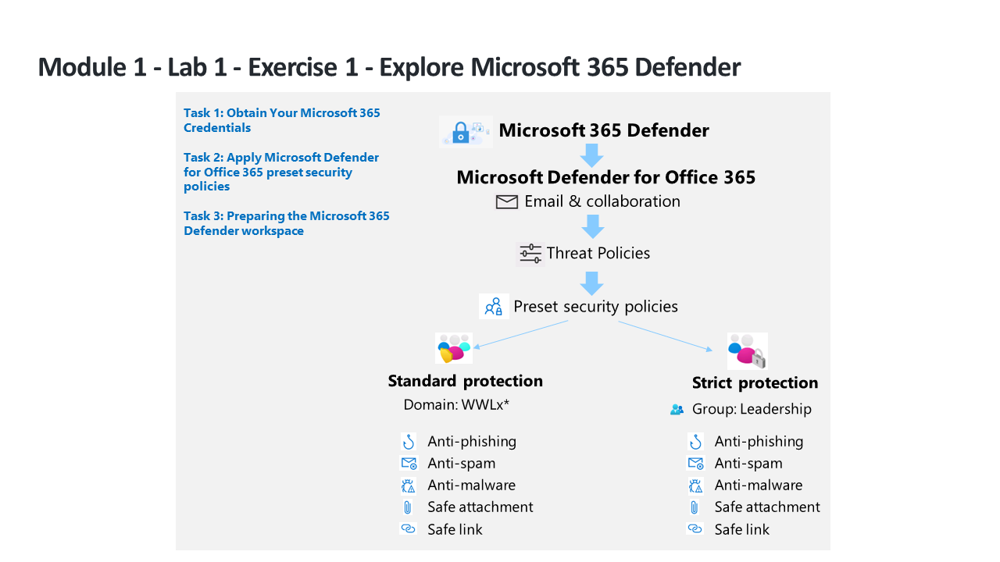

---
lab:
  title: Übung 1 – Erkunden von Microsoft Defender XDR
  module: Learning Path 1 - Mitigate threats using Microsoft Defender XDR
---

# Lernpfad 1 – Lab 1 – Übung 1 – Erkunden von Microsoft Defender XDR

## Labszenario

Sie arbeiten als Security Operations Analyst in einem Unternehmen, das Microsoft Defender XDR implementiert. Zunächst weisen Sie voreingestellte Sicherheitsrichtlinien zu, die in Exchange Online Protection (EOP) und Microsoft Defender for Office 365 verwendet werden.

>**Hinweis:****WWL-Mandanten – Nutzungsbedingungen** Wenn Ihnen im Rahmen einer Präsenzschulung ein Mandant zugewiesen worden ist, steht dieser für Praxislabs innerhalb der Präsenzschulung zur Verfügung. Mandanten sollten nicht für Zwecke außerhalb von Praxislabs freigegeben oder verwendet werden. Der in diesem Kurs verwendete Mandant ist ein Testmandant; er kann nach Abschluss des Kurses nicht verwendet oder erreicht werden und ist nicht für Erweiterungen geeignet. Mandanten dürfen nicht in ein kostenpflichtiges Abonnement konvertiert werden. Die im Rahmen dieses Kurses erworbenen Mandanten verbleiben im Eigentum der Microsoft Corporation, und wir behalten uns das Recht vor, jederzeit auf Mandanten zuzugreifen und diese zurückzuziehen. 

### Aufgabe 1: Abrufen Ihrer Microsoft 365-Anmeldeinformationen

Nachdem Sie das Lab gestartet haben, wird Ihnen ein kostenloser Testmandant zur Verfügung gestellt, auf den Sie in der Microsoft virtual Lab-Umgebung zugreifen können. Diesem Mandanten wird automatisch ein eindeutiger Benutzername und ein eindeutiges Kennwort zugewiesen. Sie benötigen diesen Benutzernamen und das Kennwort, um sich bei Azure und Microsoft 365 in der virtuellen Lab-Umgebung von Microsoft anzumelden. 

Da dieser Kurs von Lernpartnern angeboten werden kann, die einen der verschiedenen autorisierten Anbieter für das Hosten von Labs (ALH) nutzen, können die tatsächlichen Schritte zum Abrufen der Ihrem Mandanten zugewiesenen Mandanten-ID je nach Anbieter für das Hosten von Labs unterschiedlich sein. Ihr Kursleiter wird Ihnen daher die notwendigen Anweisungen zum Abrufen dieser Informationen für Ihren Kurs geben. Notieren Sie sich die folgenden Informationen für die spätere Verwendung:

- **Mandantensuffix-ID.** Diese ID ist für die onmicrosoft.com-Konten bestimmt, die Sie in den Labs für die Anmeldung bei Microsoft 365 verwenden. Es hat das Format **{Benutzername}@ZZZZZZ.onmicrosoft.com**, wobei ZZZZZZ Ihre eindeutige Mandanten-Suffix-ID ist, die Sie von Ihrem Lab-Hostinganbieter erhalten haben. Notieren Sie sich diesen Wert ZZZZZZ für die spätere Verwendung. Wenn Sie in einem der Lab-Schritte aufgefordert werden, sich bei Microsoft 365-Portalen anzumelden, müssen Sie den ZZZZZZ-Wert eingeben, den Sie hier erhalten haben.
- **Mandantenkennwort.** Geben Sie das Administratorkennwort ein, das von Ihrem Labhostinganbieter erhalten haben.

### Aufgabe 2: Anwenden der voreingestellten Sicherheitsrichtlinien von Microsoft Defender für Office 365

In dieser Aufgabe weisen Sie im Microsoft 365 Security-Portal voreingestellte Sicherheitsrichtlinien für Exchange Online Protection (EOP) und Microsoft Defender for Office 365 zu.

1. Melden Sie sich beim virtuellen Computer WIN1 als Administrator mit dem Kennwort **Pa55w.rd** an.  

1. Starten Sie den Microsoft Edge-Browser.

1. Wechseln Sie im Microsoft Edge-Browser zum Microsoft Defender XDR-Portal unter <https://security.microsoft.com>.

1. Kopieren Sie im Dialogfeld **Anmelden**das von Ihrem Labhostinganbieter bereitgestellte Mandanten-E-Mail-Konto für den Administrator, und fügen Sie es ein, und wählen Sie dann **Weiter** aus.

1. Kopieren Sie im Dialogfeld **Kennwort eingeben** das von Ihrem Labhostinganbieter bereitgestellte Mandantenkennwort für den Administrator, und fügen Sie es ein, und wählen Sie dann **Anmelden** aus.

    >**Hinweis:** Wenn Sie die Meldung „Der Vorgang konnte nicht abgeschlossen werden. Versuchen Sie es später noch mal. Wenn das Problem weiterhin besteht, wenden Sie sich an den Microsoft-Support.“ Klicken Sie einfach auf **OK**, um fortzufahren.  

1. Wenn angezeigt, schließen Sie das Popupfenster der Microsoft Defender XDR-Schnelltour. **Hinweis:** Zu einem späteren Zeitpunkt in diesem Lab müssen Sie warten, bis der Defender-Arbeitsbereich bereitgestellt wird. Sie können diese Zeit nutzen, um durch die geführten Touren zu navigieren und mehr über Microsoft Defender XDR zu erfahren.

1. Wählen Sie im Navigationsmenü unter *E-Mail & Zusammenarbeit* den Bereich **Richtlinien und Regeln** aus.

1. Wählen Sie im Dashboard *Richtlinien und Regeln*die Option **Bedrohungsrichtlinien**aus.

1. Wählen Sie im Dashboard *Bedrohungsrichtlinien* die Option **Voreingestellte Sicherheitsrichtlinien** aus.

    >**Hinweis:** Wenn Sie die Meldung *„Client Fehler – Fehler beim Abrufen der BIP-Regel“* erhalten, wählen Sie **OK** aus, um fortzufahren. Der Fehler ist auf den Hydrationsstatus Ihres Mandanten in Office 365 zurückzuführen, der standardmäßig nicht aktiviert ist.

    >**Hinweis:** Wenn Sie die Meldung erhalten: *„Client-Fehler – Beim Abrufen der voreingestellten Sicherheitsrichtlinien ist ein Fehler aufgetreten. Bitte versuchen Sie es später erneut.“* Wählen Sie **OK** aus, um fortzufahren. Aktualisieren Sie Ihren Browser mit **STRG+F5**.

1. Wählen Sie auf der Seite **Erfahren Sie mehr über die voreingestellten Sicherheitsrichtlinien***Aufklappen* **Schließen** aus.

1. Wählen Sie unter *Standardschutz* die Option **Schutzeinstellungen verwalten** aus. **Hinweis:** Wenn diese Option grau dargestellt wird, aktualisieren Sie Ihren Browser mit **Strg+F5**.

1. Wählen Sie im Abschnitt *Exchange Online Protection anwenden* die Option **Bestimmte Empfänger** und beginnen Sie unter **Domänen** mit der Eingabe des Domänennamens Ihres Mandanten, wählen Sie ihn aus und wählen Sie dann **Weiter**aus.

    >**Hinweis:** Der Domänenname Ihres Mandanten ist derselbe Name wie der Ihres Administratorkontos. Dieser könnte *WWLx######.onmicrosoft.com* lauten. Beachten Sie, dass diese Konfiguration Richtlinien für Anti-Spam, ausgehenden Spam, Anti-Malware und Anti-Phishing anwendet.

1. Wenden Sie im Abschnitt *Defender for Office 365-Schutz anwenden* die gleiche Konfiguration wie im vorherigen Schritt an und wählen Sie **Weiter**aus. Beachten Sie, dass diese Konfiguration Richtlinien für Anti-Phishing, sichere Anhänge und sichere Links anwendet.

1. Wählen Sie im Abschnitt *Schutz vor Identitätswechsel* viermal (4x) **Weiter**aus, um fortzufahren.

1. Vergewissern Sie sich im Abschnitt *Richtlinienmodus*, dass die Optionsschaltfläche **Richtlinie nach Abschluss aktivieren** aktiviert ist, und wählen Sie dann **Weiter**aus.

1. Lesen Sie den Inhalt unter *Änderungen überprüfen und bestätigen* und wählen Sie **Bestätigen**aus, um die Änderungen zu übernehmen und wählen Sie **Fertig**aus, um den Vorgang abzuschließen.

    >**Hinweis:** Wenn Sie die Meldung *„Der URI ‚<https://outlook.office365.com/psws/service.svc/AntiPhishPolicy>‘ ist für die PUT-Operation nicht gültig. Der URI muss auf eine einzelne Ressource für PUT-Operationen zeigen“*, wählen Sie einfach **OK** und dann **Abbrechen**, um zur Hauptseite zurückzukehren. Sie werden sehen, dass die Option *Standardschutz ist aktiviert* aktiviert ist.

1. Wählen Sie unter *Strenger Schutz* die Option **Schutzeinstellungen verwalten**aus. **Hinweis: ***Strenger Schutz* finden Sie unter „E-Mails und Zusammenarbeit – Richtlinien und Regeln – Bedrohungsrichtlinien – Voreingestellte Sicherheitsrichtlinien“.

1. Wählen Sie unter *Exchange Online Protection anwenden* die Option **Bestimmte Empfänger** und beginnen Sie unter **Gruppen** mit der Eingabe von **Führung**, wählen Sie diese aus und wählen Sie dann **Weiter**aus. Beachten Sie, dass diese Konfiguration Richtlinien für Anti-Spam, ausgehenden Spam, Anti-Malware und Anti-Phishing anwendet.

1. Wenden Sie im Abschnitt *Defender for Office 365-Schutz anwenden* die gleiche Konfiguration wie im vorherigen Schritt an und wählen Sie **Weiter**aus. Beachten Sie, dass diese Konfiguration Richtlinien für Anti-Phishing, sichere Anhänge und sichere Links anwendet.

1. Wählen Sie im Abschnitt *Schutz vor Identitätswechsel* viermal (4x) **Weiter**aus, um fortzufahren.

1. Vergewissern Sie sich im Abschnitt *Richtlinienmodus*, dass die Optionsschaltfläche **Richtlinie nach Abschluss aktivieren** aktiviert ist, und wählen Sie dann **Weiter**aus.

1. Lesen Sie den Inhalt unter *Änderungen überprüfen und bestätigen* und wählen Sie **Bestätigen**aus, um die Änderungen zu übernehmen und wählen Sie **Fertig**aus, um den Vorgang abzuschließen.

    >**Hinweis:** Wenn Sie die Meldung *„Der URI ‚<https://outlook.office365.com/psws/service.svc/AntiPhishPolicy>‘ ist für die PUT-Operation nicht gültig. Der URI muss auf eine einzelne Ressource für PUT-Operationen zeigen“*, wählen Sie einfach **OK** und dann **Abbrechen**, um zur Hauptseite zurückzukehren. Sie werden sehen, dass die Option *Strenger Schutz ist aktiviert* aktiviert ist.

### Aufgabe 3: Vorbereiten des Microsoft Defender XDR-Arbeitsbereichs

1. Wählen Sie im **Microsoft Defender**-Portal im Navigationsmenü auf der linken Seite **Startseite** aus.

    >**Hinweis:** Möglicherweise müssen Sie im Menü ganz nach oben scrollen.

1. Scrollen Sie die Menüelemente nach unten zu **Ressourcen**, und wählen Sie **Geräte** aus.

1. Der Prozess zum Bereitstellen des Defender XDR-Arbeitsbereichs sollte gestartet werden, und es sollten Meldungen wie *Laden und Initialisieren* kurz oben auf der Seite angezeigt werden. Dann sehen Sie ein Bild eines Kaffeebechers und folgende Meldung: **Warten Sie einen Moment! Wir bereiten neue Orte für Ihre Daten vor und verbinden sie.** Die Bereitstellung dauert ungefähr fünf Minuten. *Lassen Sie die Seite geöffnet, und stellen Sie sicher, dass die Bereitstellung abgeschlossen wird, da sie für das nächste Lab erforderlich ist.*

    >**Hinweis:** Ignorieren Sie die Popups mit der Fehlermeldung: *Einige Ihrer Daten können nicht abgerufen werden*. Wenn die Meldung „Warten Sie einen Moment. Wir bereiten neue Speicherplätze für Ihre Daten vor und verknüpfen sie.“ nicht angezeigt wird, oder die Seite „Einstellungen > Microsoft Defender XDR > Konto“ geöffnet wird, Ihnen jedoch die Meldung *Fehler beim Laden des Datenspeicherorts. Versuchen Sie es später erneut.* angezeigt wird, wählen Sie im Menü „Allgemein“ die Option „Diensteinstellungen für Warnungen“ aus.

1. Wenn die neue Arbeitsbereichsinitialisierung erfolgreich abgeschlossen ist, wird auf der Portalseite **Startseite** ein Banner **SIEM und XDR an einem zentralen Ort abrufen** angezeigt. Außerdem sind in den **Einstellungen** die allgemeinen Microsoft Defender XDR-Einstellungen für Konto, E-Mail-Benachrichtigungen, **Vorschaufeatures**, Warnungsdiensteinstellungen, Berechtigungen und Rollen und Streaming-API jetzt aktiviert.

## Damit haben Sie das Lab beendet
