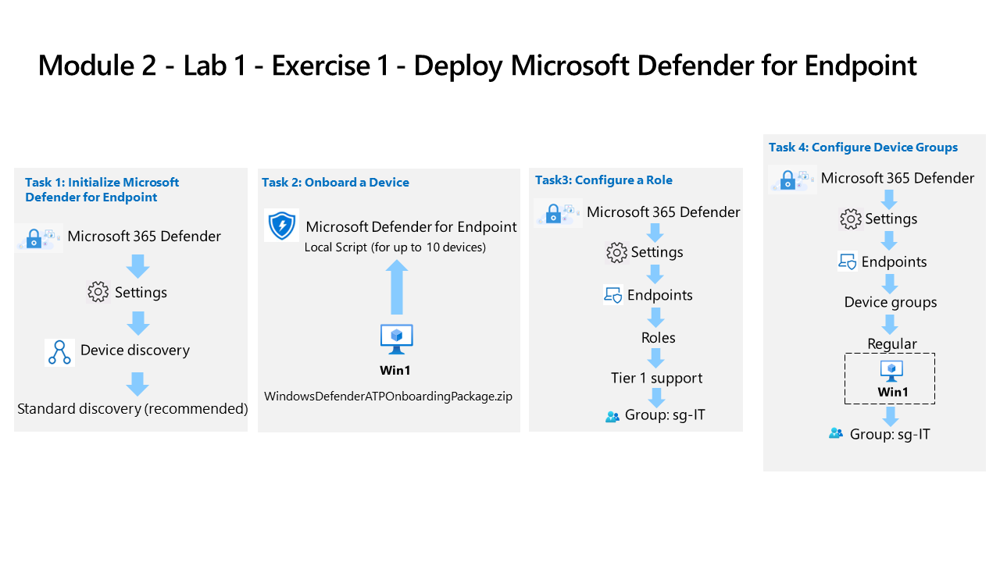

---
lab:
  title: Übung 1 – Bereitstellen von Microsoft Defender for Endpoint
  module: Learning Path 4 - Mitigate threats using Microsoft Defender for Endpoint
---

# Lernpfad 4 – Lab 1 – Übung 1: Bereitstellen von Microsoft Defender for Endpoint

## Labszenario

Sie arbeiten als Security Operations Analyst in einem Unternehmen, das Microsoft Defender für Endpunkt implementiert. Ihr Vorgesetzter plant, einige Geräte zu integrieren, um einen Einblick in die erforderlichen Änderungen der Reaktionsverfahren des SecOps-Teams zu erhalten.

Zunächst initialisieren Sie die Defender for Endpoint-Umgebung. Danach führen Sie das Onboarding der ersten Geräte für die Bereitstellung durch, indem Sie das Onboardingskript auf den Geräten ausführen. Sie konfigurieren die Sicherheit für die Umgebung. Schließlich erstellen Sie Gerätegruppen und weisen die entsprechenden Geräte zu.

>**Wichtig:** Die virtuellen Lab-Computer werden über verschiedene Module verwendet. SPEICHERN Sie Ihre virtuellen Computer. Wenn Sie das Lab verlassen, ohne zu speichern, müssen Sie einige Konfigurationen erneut durchführen.

>**Hinweis:** Stellen Sie sicher, dass Sie Aufgabe 3 des ersten Moduls erfolgreich abgeschlossen haben.

### Geschätzte Zeit bis zum Abschluss dieses Labs: 30 Minuten

### Aufgabe 1: Initialisieren von Microsoft Defender for Endpunkt

In dieser Aufgabe führen Sie die Initialisierung von Microsoft Defender for Endpoint aus.

1. Melden Sie sich als Admin bei der virtuellen Maschine **WIN1** mit dem Passwort: **Pa55w.rd** an.  

1. Wenn Sie sich noch nicht im Microsoft Defender XDR-Portal befinden, starten Sie den Microsoft Edge-Browser.

1. Wechseln Sie im Edge-Browser zum Microsoft Defender XDR-Portal unter (<https://security.microsoft.com>).

1. Kopieren Sie im Dialogfeld **Anmelden**das von Ihrem Labhostinganbieter bereitgestellte Mandanten-E-Mail-Konto für den Administrator, und fügen Sie es ein, und wählen Sie dann **Weiter** aus.

1. Kopieren Sie im Dialogfeld **Kennwort eingeben** das von Ihrem Labhostinganbieter bereitgestellte Mandantenkennwort für den Administrator, und fügen Sie es ein, und wählen Sie dann **Anmelden** aus.

    >**Tipp:** Das Administrator-E-Mail-Konto und Kennwort des Mandanten finden Sie auf der Registerkarte „Ressourcen“.

1. Scrollen Sie auf dem **Defender XDR**-Portal im Navigationsmenü auf der linken Seite nach unten, erweitern Sie den Abschnitt **System** und wählen Sie **Einstellungen** aus.

    >**Hinweis:** Einige Versionen des Portals verfügen möglicherweise nicht über die Option **Einstellungen** unter dem Abschnitt **System**. **Einstellungen** kann mit *Berichte* und *Audit* gruppiert werden.

1. Wählen Sie auf der Seite „Einstellungen“ die Option **Geräteermittlung** aus.

    >**Hinweis:** Wenn Sie die Option **Geräteerkennung** unter **Einstellungen** nicht sehen, melden Sie sich ab, indem Sie auf den Kreis mit Ihren Kontoinitialen oben rechts klicken und dann auf **Abmelden**. Sie können auch versuchen, die Seite mit STRG+F5 zu aktualisieren oder InPrivate zu öffnen. Melden Sie sich erneut mit den **E-Mail des Mandanten**-Anmeldeinformationen an.

1. Stellen Sie im Setup der Ermittlung sicher, dass **Standardermittlung (empfohlen)** ausgewählt ist. 

    >**Tipp:** Wenn Sie die Option nicht sehen, aktualisieren Sie die Seite.

### Aufgabe 2: Ein Gerät einbinden

In dieser Aufgabe integrieren Sie ein Gerät in Microsoft Defender for Endpoint mithilfe eines Onboardingskripts.

1. Scrollen Sie im **Defender XDR**-Portal im Navigationsmenü auf der linken Seite nach unten und erweitern Sie den Abschnitt **System**, wählen Sie **Einstellungen** und wählen Sie dann auf der Seite Einstellungen **Endpunkte** aus.

1. Wählen Sie **Onboarding** im Abschnitt Geräteverwaltung aus.

    >**Hinweis:** Sie können das Onboarding von Geräten auch über den Abschnitt **Objekte** in der linken Menüleiste durchführen. Erweitern Sie Objekte, und wählen Sie Geräte aus. Scrollen Sie auf der Seite Geräteinventarisierung mit der Auswahl Computer und Mobilgeräte nach unten zu **Onboarding von Geräten.** Daraufhin erscheint die Seite **Einstellungen > Endpunkte**.

1. Im Bereich „1. Gerät einbinden“ stellen Sie sicher, dass „Lokales Skript (für bis zu 10 Geräte)“ in der Dropdownliste „Bereitstellungsmethode“ angezeigt wird und klicken Sie auf die Schaltfläche **Onboarding-Paket herunterladen**.

1. Markieren Sie im Popupfenster *Downloads* die Datei „WindowsDefenderATPOnboardingPackage.zip“ mit der Maus und klicken Sie auf das Ordnersymbol **Im Ordner anzeigen**. **Tipp:** Wenn Sie es nicht sehen, sollte sich die Datei im Verzeichnis c:\users\admin\downloads befinden.

    >**Tipp:** Wenn Ihr Browser den Download blockiert, ergreifen Sie Maßnahmen im Browser, um ihn zuzulassen. Im Microsoft Edge-Browser erhalten Sie möglicherweise die Meldung „*WindowsDefenderATPOnboardingPackage.zip wird in der Regel nicht heruntergeladen. Stellen Sie sicher, dass Sie …* vertrauen, klicken Sie ggf. auf die Schaltfläche Auslassungspunkte (...) und dann auf **Beibehalten**“. In Microsoft Edge erscheint ein zweites Popupfenster mit der Meldung „*Stellen Sie sicher, dass Sie WindowsDefenderATPOnboardingPackage.zip vertrauen, bevor Sie es öffnen*“, klicken Sie auf **Mehr anzeigen**, um die Auswahl zu erweitern, und anschließend auf **Trotzdem beibehalten**.

1. Klicken Sie mit der rechten Maustaste auf die heruntergeladene Zip-Datei und wählen Sie **Alles extrahieren …**, stellen Sie sicher, dass *Extrahierte Dateien nach Abschluss anzeigen* markiert ist und klicken Sie auf **Extrahieren**.

1. Klicken Sie mit der rechten Maustaste auf die extrahierte Datei „WindowsDefenderATPLocalOnboardingScript.cmd“ und wählen Sie **Eigenschaften** aus. Markieren Sie das Kontrollkästchen **Entsperren** unten rechts im Eigenschaftenfenster und klicken Sie auf **OK**.

1. Klicken Sie erneut mit der rechten Maustaste auf die extrahierte Datei „WindowsDefenderATPLocalOnboardingScript.cmd“ und wählen Sie **Als Administrator ausführen** aus.  **Tipp:** Wenn das Windows SmartScreen-Fenster erscheint, klicken Sie auf **Mehr Info** und wählen Sie **trotzdem ausführen** aus.

1. Wenn das Fenster „Benutzerkontensteuerung“ angezeigt wird, wählen Sie **Ja** aus, damit das Skript ausgeführt werden kann, beantworten Sie die vom Skript gestellte Frage mit **Ja** und drücken Sie die **Eingabetaste**. Wenn Sie fertig sind, sollten Sie eine Meldung auf dem Befehlsbildschirm sehen, die besagt: *Computer erfolgreich in Microsoft Defender for Endpoint integriert*.

1. Press any key to continue... Damit wird das Eingabeaufforderungsfenster geschlossen.

### Aufgabe 3: Konfigurieren von Rollen

In dieser Aufgabe konfigurieren Sie Rollen für die Verwendung mit Gerätegruppen.

1. Erweitern Sie in der linken Menüleiste des Microsoft Defender XDR-Portals den Abschnitt **System** und wählen Sie **Einstellungen**, dann **Endpunkte** aus.

1. Wählen Sie im Bereich „Berechtigungen“ die Option **Rollen** aus.

1. Wählen Sie die Schaltfläche **Rollen aktivieren** aus.

1. Wählen Sie **+ Rolle hinzufügen** aus.

1. Geben Sie im Dialogfeld „Rolle hinzufügen“ die folgenden Daten ein:

    |Allgemeine Einstellung|Wert|
    |---|---|
    |Rollenname|**Support der Ebene 1**|
    |Berechtigungen|Livereaktionsfunktionen – Erweitert|

1. Wählen Sie **Weiter** aus.

1. Geben Sie auf der Seite **Zugeordnete Benutzergruppen** **sg-IT** in das Formular *Benutzergruppen filtern* ein, und wählen Sie dann **Ausgewählte Gruppen hinzufügen** aus. Stellen Sie sicher, dass sie unter *Azure AD-Benutzergruppen mit dieser Rolle* angezeigt wird.

1. Klicken Sie auf **Senden** und dann auf **Fertig**, wenn Sie fertig sind.

    >**Hinweis:** Wenn Sie die Fehlermeldung *„Der Benutzer kann diese Aktion nicht ausführen, da sein UserAuthEnforcementMode Rbac ist und diese Aktion eine der folgenden Bedingungen erfordert: RbacV2“* erhalten, klicken Sie auf **OK** und versuchen Sie es erneut.

### Aufgabe 4: Konfigurieren von Gerätegruppen

In dieser Aufgabe konfigurieren Sie Gerätegruppen, die die Zugriffssteuerung und die Automatisierungskonfiguration ermöglichen.

1. Erweitern Sie in der linken Menüleiste des Microsoft Defender XDR-Portals den Abschnitt **System** und wählen Sie **Einstellungen**, dann **Endpunkte** aus.

1. Wählen Sie im Bereich Berechtigungen die Option **Gerätegruppen** aus.

1. Wählen Sie das Symbol **+ Gerätegruppe hinzufügen** aus.

1. Geben Sie auf der Registerkarte Allgemein die folgenden Informationen ein:

    |Allgemeine Einstellung|Wert|
    |---|---|
    |Name der Gerätegruppe|**Regulär**|
    |Wartungsebene|Vollständig – Automatisches Beheben von Bedrohungen|

1. Wählen Sie **Weiter** aus.

1. Wählen Sie auf der Registerkarte „Geräte“ für die Betriebssystemvoraussetzung **Windows 10** und klicken Sie auf **Weiter**.

    >**Hinweis:** Einige Lab-Hostinganbieter haben möglicherweise *Windows 11*-Images für WIN1 konfiguriert. Sie können eines oder beide auswählen.

1. Auf der Registerkarte „Gerätevorschau“ könnte die Schaltfläche *Vorschau anzeigen* den virtuellen Computer WIN1 anzeigen, aber höchstwahrscheinlich sind die Daten noch nicht ausgefüllt. Klicken Sie auf **Weiter**, um fortzufahren.

1. Wählen Sie auf der Registerkarte Benutzerzugriff die Option **sg-IT** und dann die Schaltfläche **Ausgewählte Gruppen hinzufügen** aus. Vergewissern Sie sich, dass die Gruppe unter *Azure AD-Benutzergruppen mit Zugriff auf diese Gerätegruppe* angezeigt wird.

1. Klicken Sie auf **Senden** und dann auf **Fertig**, wenn Sie fertig sind.

1. Die Gerätegruppenkonfiguration wurde geändert. Klicken Sie auf **Änderungen übernehmen**, um die Übereinstimmungen zu überprüfen und die Gruppierungen neu zu berechnen.

1. Sie haben jetzt zwei Gerätegruppen: die von Ihnen erstellte Gruppe „Regulär“ und die Gruppe „Nicht gruppierte Geräte (Standard)“ mit der gleichen Korrekturstufe.

## Fahren Sie mit Übung 2 fort
