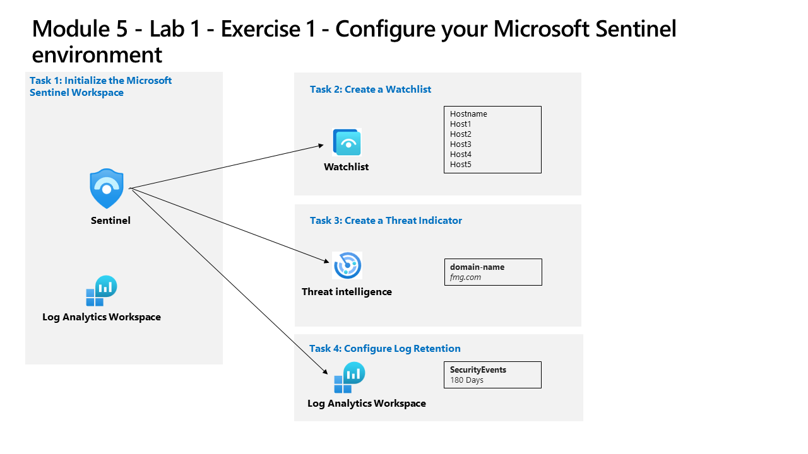

---
lab:
  title: Übung – Konfigurieren Ihrer Microsoft Sentinel-Umgebung
  module: Learning Path 5 - Configure your Microsoft Sentinel environment
---

# Lernpfad 5 – Lab 1 – Übung 1 – Konfigurieren Ihrer Microsoft Sentinel-Umgebung

## Labszenario



Sie sind Security Operations Analyst in einem Unternehmen, das Microsoft Sentinel implementiert. Sie sind dafür verantwortlich, die Microsoft Sentinel-Umgebung so einzurichten, dass die Anforderungen des Unternehmens im Hinblick auf die Minimierung der Kosten sowie der Einhaltung der Compliancebestimmungen erfüllt werden, und die am besten verwaltbare Umgebung für Ihr Sicherheitsteam bereitzustellen, damit es seine täglichen Aufgaben erfüllen kann.

>**Hinweis:** Eine **[interaktive Labsimulation](https://mslabs.cloudguides.com/guides/SC-200%20Lab%20Simulation%20-%20Configure%20your%20Microsoft%20Sentinel%20environment)** ist verfügbar, mit der Sie dieses Lab in Ihrem eigenen Tempo durcharbeiten können. Möglicherweise liegen geringfügige Unterschiede zwischen der interaktiven Simulation und dem gehosteten Lab vor, aber die dargestellten Kernkonzepte und Ideen sind identisch. 


### Aufgabe 1: Initialisieren des Microsoft Sentinel-Arbeitsbereichs

In dieser Aufgabe erstellen Sie einen Microsoft Sentinel-Arbeitsbereich.

1. Melden Sie sich beim virtuellen Computer **WIN1** als Administrator mit dem Kennwort **Pa55w.rd**an.  

1. Öffnen Sie den Chrome-Browser.

1. Navigieren Sie im Edge-Browser zum Azure-Portal unter https://portal.azure.com.

1. Kopieren Sie im Dialogfeld **Anmelden** die **E-Mail vom Mandanten**, die Sie von Ihrem Labhostinganbieter erhalten haben, und wählen Sie **Weiter**.

1. Kopieren Sie im Dialogfeld **Kennwort eingeben** das **Kennwort des Mandanten**, das Sie von Ihrem Labhostinganbieter erhalten haben, und fügen Sie es ein. Wählen Sie dann **Anmelden**.

1. Geben Sie in der Suchleiste des Azure-Portals *Sentinel* ein, und wählen Sie dann ** Microsoft Sentinel** aus.

1. Wählen Sie **+ Erstellen** aus.

1. Als Nächstes wählen Sie den Log Analytics-Arbeitsbereich aus, den Sie zuvor erstellt haben, zum Beispiel *uniquenameDefender* und wählen **Hinzufügen** aus. Die Aktivierung kann einige Minuten dauern.

    >**Hinweis:** Wenn hier kein Log Analytics-Arbeitsbereich angezeigt wird, lesen Sie bitte Modul 3, Übung 1, Aufgabe 2, um einen zu erstellen.

1. In **Microsoft Sentinel** sollten Sie sich im Abschnitt **Allgemeinen** *Neuigkeiten und Leitfäden* befinden und folgenden Hinweis sehen: *Kostenlose Testversion von Microsoft Sentinel aktiviert*. Klicken Sie auf die Schaltfläche **OK**.

1. Navigieren Sie durch den neu erstellten Microsoft Sentinel-Arbeitsbereich, um sich mit den Optionen der Benutzeroberfläche vertraut zu machen.

### Aufgabe 2: Erstellen einer Watchlist

In dieser Aufgabe erstellen Sie eine Watchlist in Microsoft Sentinel.

1. Geben Sie *Notepad* in das Suchfeld am unteren Rand des Windows 10-Bildschirms ein. Wählen Sie aus den Ergebnissen **Notepad** aus.

1. Geben Sie *Hostname* ein und drücken Sie die Eingabetaste, um eine neue Zeile zu beginnen.

1. Kopieren Sie aus Zeile 2 des Notepads die folgenden Hostnamen, jeweils in eine andere Zeile:

    ```Notepad
    Host1
    Host2
    Host3
    Host4
    Host5
    ```

1. Wählen Sie im Menü **Datei – Speichern unter**, benennen Sie die Datei *HighValue.csv*, ändern Sie den Dateityp auf **Alle Dateien(*.*)** und wählen Sie **Speichern** aus. **Hinweis:** Die Datei kann im Ordner *Dokumente* gespeichert werden.

1. Schließen Sie den Editor.

1. Wählen Sie in Microsoft Sentinel unter Konfiguration die Option **Watchlist** aus.

1. Wählen Sie in der Befehlsleiste **+ Neu hinzufügen** aus.

1. Geben Sie im Watchlist-Assistenten Folgendes ein:

    |Allgemeine Einstellung|Wert|
    |---|---|
    |Name|**HighValueHosts**|
    |Beschreibung|**High Value Hosts**|
    |Alias „Watchlist“|**HighValueHosts**|

1. Wählen Sie die Option **Weiter: Quelle >** aus.

1. Wählen Sie **Dateien suchen** unter *Datei hochladen* und suchen Sie die soeben erstellte Datei *HighValue.csv* aus.

1. Wählen Sie im Feld *SearchKey* **Hostname** aus.

1. Wählen Sie **Weiter: Überprüfen und erstellen** aus.

1. Überprüfen Sie die eingegebenen Einstellungen und wählen Sie **Erstellen** aus.

1. Der Bildschirm kehrt zur Seite Watchlist zurück.

1. Wählen Sie die Watchlist *HighValueHosts* aus und wählen Sie auf der rechten Seite **In Logs anzeigen**.

    >**Wichtig:** Es kann bis zu zehn Minuten dauern, bis die Watchlist angezeigt wird. **Bitte fahren Sie mit der nächsten Aufgabe fort und führen Sie diesen Befehl im nächsten Lab aus**.
    
    >**Hinweis:** Sie können nun die _GetWatchlist(‚HighValueHosts’) in Ihren eigenen KQL-Anweisungen verwenden, um auf die Liste zuzugreifen. Die zu referenzierende Spalte wäre *Hostname*.

1. Schließen Sie das Fenster *Protokolle*, indem Sie das ‚x‘ oben rechts auswählen und wählen Sie **OK** aus, um die nicht gespeicherten Änderungen zu verwerfen.


### Aufgabe 3: Erstellen eines Bedrohungsindikators

In dieser Aufgabe erstellen Sie einen Indikator in Microsoft Sentinel.

1. Wählen Sie in Microsoft Sentinel im Bereich Bedrohungsmanagement die Option **Threat Intelligence** aus.

1. Wählen Sie in der Befehlsleiste **+ Neu hinzufügen** aus.

1. Überprüfen Sie die verschiedenen verfügbaren Indikatortypen in der Dropdown-Liste *Typen*. Wählen Sie den **Domänennamen** aus. 

1. Geben Sie für Domain einen Domainnamen ein, zum Beispiel *contoso.com*.

1. Wählen Sie für *Bedrohungsarten* die Option **+ Hinzufügen** und geben Sie **Schädliche Aktivität** ein. Klickan Sie auf **OK**.

1. Geben Sie eine **Beschreibung** ein.

1. Geben Sie für den **Namen** den gleichen Wert wie für die Domain ein.

1. Setzen Sie das Feld **Gültig ab** auf das aktuelle Datum.

1. Wählen Sie **Übernehmen**.

1. Wählen Sie unter Allgemein die Option **Protokolle** aus. Eventuell können Sie die Option „Abfragen immer anzeigen“ deaktivieren und das Fenster *Abfragen* schließen, um die KQL-Anweisungen auszuführen.

1. Führen Sie die folgende KQL-Anweisung aus.

    ```KQL
    ThreatIntelligenceIndicator
    ```

    >**Hinweis:** Es kann bis zu fünf Minuten dauern, bis der Indikator angezeigt wird.

1. Scrollen Sie nach rechts, um die Spalte DomainName zu sehen. Sie können auch die folgende KQL-Anweisung ausführen, um nur die Spalte DomainName anzuzeigen. 

    ```KQL
    ThreatIntelligenceIndicator 
    | project DomainName
    ```


### Aufgabe 4: Konfigurieren der Protokollaufbewahrung

In dieser Aufgabe ändern Sie die Aufbewahrungszeit für die Tabelle SecurityEvent.

1. Wählen Sie in Microsoft Sentinel unter *Konfiguration* die Option **Einstellungen** aus.

1. Wählen Sie **Arbeitsbereichseinstellungen** aus.

1. Wählen Sie im Arbeitsbereich Log Analytics unter dem Bereich *Einstellungen* die Option **Tabellen** aus.

1. Suchen und wählen Sie die Tabelle **SecurityEvent** und wählen Sie dann die Schaltfläche mit dem Auslassungszeichen (…).

1. Wählen Sie **Tabelle verwalten** aus.

1. Wählen Sie **180 Tage** für den *Gesamten Aufbewahrungszeitraum* aus. Beachten Sie, dass der *Archivierungszeitraum* nur 150 Tage beträgt, da er 30 Tage aus der (standardmäßigen) *Interaktiven Aufbewahrung* verwendet.

1. Klicken Sie auf **Speichern**, um die Änderungen zu übernehmen.


## Damit haben Sie das Lab beendet.
