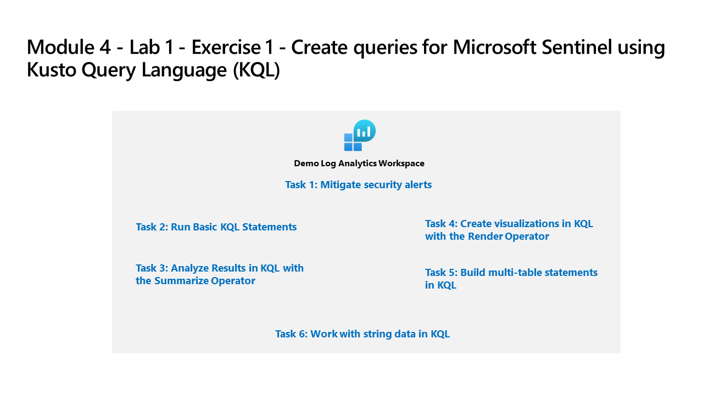

---
lab:
  title: Übung 1 – Erstellen von Abfragen für Microsoft Sentinel mithilfe von Kusto Query Language (KQL)
  module: Learning Path 6 - Create queries for Microsoft Sentinel using Kusto Query Language (KQL)
---

# Lernpfad 6 – Lab 1 – Übung 1: Erstellen von Abfragen für Microsoft Sentinel mit der Kusto-Abfragesprache (KQL)

## Labszenario



Sie sind Security Operations Analyst in einem Unternehmen, das Microsoft Sentinel implementiert. Sie sind für die Analyse von Protokolldaten verantwortlich, um nach schädlichen Aktivitäten zu suchen, Visualisierungen anzuzeigen und Bedrohungen aufzuspüren. Zum Abfragen von Protokolldaten verwenden Sie die Kusto-Abfragesprache (KQL).

>**Wichtig:** Die Labübungen für den Lernpfad 6 befinden sich in einer *eigenständigen* Umgebung. Wenn Sie die Übung beenden, bevor Sie diese abschließen, müssen Sie alle Konfigurationsschritte erneut ausführen.

>**Hinweis:** Die vollständige Erstellung dieses Labprofils dauert mindestens 15 Minuten, während Microsoft Sentinel in Ihrem Azure-Abonnement mit dem Namen **defenderWorkspace** vorab bereitgestellt wird.

<!--- >**Tip:** This lab involves entering many KQL scripts into Microsoft Sentinel. The scripts were provided in a file at the beginning of this lab. An alternate location to download them is:  <https://github.com/MicrosoftLearning/SC-200T00A-Microsoft-Security-Operations-Analyst/tree/master/Allfiles> --->

### Geschätzte Zeit bis zum Abschluss dieses Labs: 60 Minuten

### Aufgabe 1: Vorbereiten des KQL-Testbereichs

Bei dieser Aufgabe installieren Sie die **Microsoft Sentinel-Trainingslablösung** aus dem Marketplace, die einen Log Analytics-Arbeitsbereich mit Beispieldaten auffüllt, mit denen Sie das Schreiben von KQL-Anweisungen üben können.

1. Melden Sie sich beim virtuellen **WIN1-Computer** als Administrator mit dem Kennwort **Pa55w.rd** an.  

1. Wechseln Sie im Browser Microsoft Edge zu <https://portal.azure.com>, und melden Sie sich mit den Ihnen zugewiesenen Anmeldeinformationen an.

1. Geben Sie in der Azure-Suchleiste **Microsoft Sentinel-Trainingslablösung** ein, und wählen Sie diese aus den Ergebnissen aus.

    >**Hinweis:** Sie befindet sich im Abschnitt „Marketplace“.

1. Wählen Sie auf der Seite **Microsoft Sentinel-Trainingslablösung** die Option **Erstellen** aus, um die Lösung zu installieren.

1. Wählen Sie auf der Seite **Microsoft Sentinel-Trainingslablösung erstellen** die Ressourcengruppe **defender-RG** und den Arbeitsbereich **defenderWorkspace** aus.

1. Wählen Sie **Überprüfung und erstellen** aus, um die Lösung bereitzustellen.

1. Wenn die Überprüfung abgeschlossen ist, wählen Sie **Erstellen** aus, um die Lösung bereitzustellen.

  >**Hinweis:** Es dauert ungefähr zehn Minuten, bis die Lösung vollständig bereitgestellt wurde und alle Ressourcen verfügbar sind.

1. Warten Sie, bis die Bereitstellung abgeschlossen ist, und wählen Sie dann aus der Brotkrümelnavigation die Option **Start** aus.

### Aufgabe 2: Untersuchen des Log Analytics-Arbeitsbereichs

1. Geben Sie in der Suchleiste des Azure-Portals **Microsoft Sentinel** ein, und wählen Sie die Lösung aus den Ergebnissen aus.

1. Wählen Sie auf der Microsoft Sentinel-Seite den Arbeitsbereich **defenderWorkspace** aus.

1. Erweitern Sie in Microsoft Sentinel den Abschnitt **Allgemein**, und wählen Sie im Navigationsmenü die Option **Protokolle** aus.

1. Schließen Sie das Popupfenster „Log Analytics-Video“, das erscheint.

1. Schließen Sie den **Abfragehub**.

1. Verwenden Sie das Dropdownmenü, um von **Einfacher Modus ** zu **KQL-Modus** zu wechseln.

1. Sehen Sie sich die verfügbaren Tabellen und andere Tools an, die im *Schema und im Filterbereich* auf der linken Seite des Bildschirms aufgeführt sind.

1. Geben Sie im Abfrage-Editor die folgende Abfrage ein und wählen Sie die Schaltfläche **„Ausführen“**. Die Abfrageergebnisse sollten im unteren Fenster angezeigt werden.

    ```KQL
    SecurityEvent_CL
    ```

    >**Hinweis:** Die Tabelle *SecurityEvent_CL* ist eine benutzerdefinierte Tabelle, die von der Microsoft Sentinel-Trainingslablösung erstellt wird. Sie enthält Beispieldaten, die Sie zum Schreiben von KQL-Anweisungen verwenden können.

1. Beachten Sie, dass der Filter auf **Anzeigen: 1.000 Ergebnisse** festgelegt ist.

1. Wählen Sie **>** neben dem ersten Datensatz, um die Informationen für die Zeile zu erweitern.

### Aufgabe 3: Ausführen grundlegender KQL-Anweisungen

In dieser Aufgabe werden Sie grundlegende KQL-Anweisungen erstellen.

>**Wichtig:** Löschen Sie bei jeder Abfrage die vorherige Anweisung aus dem Abfragefenster oder öffnen Sie ein neues Abfragefenster, indem Sie **+** nach der zuletzt geöffneten Registerkarte (bis zu 25) auswählen.

1. Die folgende Anweisung demonstriert den Operator **Suchen**, der alle Spalten der Tabelle nach dem Wert durchsucht.

1. Für den *Zeitbereich* sollte im Abfragefenster die Standardeinstellung **Letzte 24 Stunden** ausgewählt sein.

1. Geben Sie im Abfragefenster die folgende Anweisung ein, und wählen Sie dann **Ausführen** aus:

    ```KQL
    search "Computer"
    ```

    >**Hinweis:** Die Verwendung des *Suchoperators* ohne bestimmte Tabellen oder qualifizierende Klauseln ist weniger effizient als tabellenspezifische und spaltenspezifische Textfilterung.

1. Die folgende Anweisung demonstriert die **Suche** über die in der **in**-Klausel angegebenen Tabellen. Geben Sie im Abfragefenster die folgende Anweisung ein, und wählen Sie dann **Ausführen** aus:

    ```KQL
    search in (SecurityEvent_CL,App*) "new"
    ```

1. Ändern Sie im Abfragefenster den *Zeitbereich* auf **Letzte 24 Stunden**.

1. Die folgenden Anweisungen demonstrieren den Operator **where**, der nach einem bestimmten Prädikat filtert. Geben Sie im Abfragefenster die folgende Anweisung ein, und wählen Sie dann **Ausführen** aus:

    >**Wichtig:** Sie sollten **Ausführen** wählen, nachdem Sie jede Abfrage aus den folgenden Codeblöcken eingegeben haben.

    ```KQL
    SecurityEvent_CL  
    | where TimeGenerated > ago(7d)
    ```

    >**Hinweis:** Der *Zeitbereich* zeigt jetzt *In der Abfrage gesetzt* an, da wir mit der Spalte „TimeGenerated“ filtern.

    ```KQL
    SecurityEvent_CL  
    | where TimeGenerated > ago(7d) and EventID_s == 4624
    ```

    ```KQL
    SecurityEvent_CL  
    | where TimeGenerated > ago(7d)
    | where EventID_s == 4624  
    | where AccountType_s =~ "user"
    ```

    ```KQL
    SecurityEvent_CL  
    | where TimeGenerated > ago(7d) and EventID_s in (4624, 4625)
 
    ```

1. Die folgende Anweisung demonstriert die Verwendung der **let**-Anweisung zur Deklaration von *Variablen*. Geben Sie im Abfragefenster die folgende Anweisung ein, und wählen Sie dann **Ausführen** aus:

    ```KQL
    let timeOffset = 10m;
    let discardEventID = 4688;
    SecurityEvent_CL
    | where TimeGenerated > ago(timeOffset*60) and TimeGenerated < ago(timeOffset)
    | where EventID_s != discardEventID
    ```

1. Die folgende Anweisung demonstriert die Verwendung der **let**-Anweisung zur Deklaration von einer *dynamischen Liste*. Geben Sie im Abfragefenster die folgende Anweisung ein, und wählen Sie dann **Ausführen** aus:

    ```KQL
    let suspiciousAccounts = datatable(account: string) [
      @"NA\timadmin", 
      @"NT AUTHORITY\SYSTEM"
    ];
    SecurityEvent_CL  
    | where TimeGenerated > ago(7d)
    | where Account_s in (suspiciousAccounts)
    ```

    >**Tipp:** Sie können die Abfrage ganz einfach neu formatieren, indem Sie die Ellipse (…) im Abfragefenster markieren und **Abfrage formatieren** wählen.

1. Die folgende Anweisung demonstriert die Verwendung der **let**-Anweisung zur Deklaration von einer *dynamischen Liste*. Geben Sie im Abfragefenster die folgende Anweisung ein, und wählen Sie dann **Ausführen** aus:

    ```KQL
    let LowActivityAccounts =
        SecurityEvent_CL 
        | summarize cnt = count() by Account_s 
        | where cnt < 1000;
    LowActivityAccounts | where Account_s contains "sql"
    ```

### Aufgabe 4: Analysieren von Ergebnissen in KQL mit dem summarize-Operator

In dieser Aufgabe erstellen Sie KQL-Anweisungen zum Aggregieren von Daten. **Summarize** gruppiert die Zeilen gemäß den **by** Group-Spalten und berechnet Aggregationen über jede Gruppe.

1. Die folgende Anweisung demonstriert die **count()**-Funktion, die eine Zählung der Gruppe zurückgibt. Geben Sie im Abfragefenster die folgende Anweisung ein, und wählen Sie dann **Ausführen** aus:

    ```KQL
    SecurityEvent_CL  
    | where TimeGenerated > ago(7d) and EventID_s == 4688  
    | summarize count() by Computer
    ```

1. Die folgende Anweisung demonstriert die **count()**-Funktion, aber in diesem Beispiel benennen wir die Spalte mit *cnt*. Geben Sie im Abfragefenster die folgende Anweisung ein, und wählen Sie dann **Ausführen** aus:

    ```KQL
    SecurityEvent_CL  
    | where TimeGenerated > ago(7d) and EventID_s == 4624  
    | summarize cnt=count() by AccountType_s, Computer
    ```

1. Die folgende Anweisung demonstriert die **dcount()**-Funktion, die eine ungefähre Anzahl der Gruppenelemente zurückgibt. Geben Sie im Abfragefenster die folgende Anweisung ein, und wählen Sie dann **Ausführen** aus:

    ```KQL
    SigninLogs_CL  
    | where TimeGenerated > ago(7d)
    | summarize dcount(IpAddress)
    ```

1. Die folgende Anweisung ist eine Regel zur Erkennung der Fehler *Benutzerkonto ist deaktiviert* in mehreren Anwendungen für dasselbe Konto. Geben Sie im Abfragefenster die folgende Anweisung ein, und wählen Sie dann **Ausführen** aus:

    ```KQL
    let timeframe = 30d;
    let threshold = 1;
    SigninLogs_CL
    | where TimeGenerated >= ago(timeframe)
    | where ResultDescription has "User account is disabled"
    | summarize applicationCount = dcount(AppDisplayName_s) by UserPrincipalName_s, IPAddress
    | where applicationCount >= threshold
    ```

1. Die folgende Anweisung demonstriert die **arg_max()** Funktion, die einen oder mehrere Ausdrücke zurückgibt, wenn das Argument maximiert ist. Die folgende Anweisung gibt die aktuellste Zeile aus der Tabelle „SecurityEvent_CL“ für den Computer *VictimPC2* zurück. Mit dem Sternchen (*) in der arg_max-Funktion werden alle Spalten für die Zeile angefordert. Geben Sie im Abfragefenster die folgende Anweisung ein, und wählen Sie dann **Ausführen** aus:

    ```KQL
    SecurityEvent_CL  
    | where Computer == "VictimPC2"
    | summarize arg_max(TimeGenerated,*) by Computer
    ```

1. Die folgende Anweisung demonstriert die **arg_min()**-Funktion, die einen oder mehrere Ausdrücke zurückgibt, wenn das Argument minimiert ist. In dieser Anweisung wird die älteste Tabelle „SecurityEvent_CL“ für den Computer *VictimPC2* als Resultset zurückgegeben. Geben Sie im Abfragefenster die folgende Anweisung ein, und wählen Sie dann **Ausführen** aus:

    ```KQL
    SecurityEvent_CL  
    | where Computer == "VictimPC2"
    | summarize arg_min(TimeGenerated,*) by Computer
    ```

1. Die folgenden Aussagen zeigen, wie wichtig es ist, die Ergebnisse auf der Grundlage der Reihenfolge der *Pipe* zu verstehen. Geben Sie im Abfragefenster die folgende Abfrage ein, und führen Sie jede Abfrage einzeln aus:

    1. **Abfrage 1** enthält Konten, deren letzte Aktivität eine Anmeldung war. Zuächst wird die Tabelle „SecurityEvent_CL“ zusammengefasst, und anschließend wird die aktuellste Zeile für jedes Konto zurückgegeben. Daraufhin werden ausschließlich Zeilen mit „EventID_s gleich 4.624 (Anmeldung)“ zurückgegeben.

        ```KQL
        SecurityEvent_CL  
        | summarize arg_max(TimeGenerated, *) by Account_s 
        | where EventID_s == 4624  
        ```

    1. **Abfrage 2** enthält die neueste Anmeldung für Konten, die angemeldet sind. Die Tabelle „SecurityEvent_CL“ wird so gefiltert, dass lediglich „EventID_s = 4.624“ eingeschlossen wird. Anschließend werden diese Ergebnisse für die neueste Anmeldezeile nach Konto zusammengefasst.

        ```KQL
        SecurityEvent_CL  
        | where EventID_s == 4624  
        | summarize arg_max(TimeGenerated, *) by Account_s
        ```

    >**Hinweis:** Sie können auch die „Gesamt-CPU“ und die „Für die verarbeitete Abfrage verwendeten Daten“ überprüfen, indem Sie den Link „Abfragedetails“ unten rechts auswählen und die Daten zwischen den beiden Aussagen vergleichen.

1. Die folgende Anweisung demonstriert die **make_list()**-Funktion, die eine *Liste* mit allen Werten innerhalb der Gruppe zurückgibt. Diese KQL-Abfrage filtert zunächst die Tabelle „EventID_s“ mit dem where-Operator. Danach sind die Ergebnisse für jeden Computer ein JSON-Array aus Konten. Das resultierende JSON-Array enthält doppelte Konten. Geben Sie im Abfragefenster die folgende Anweisung ein, und wählen Sie dann **Ausführen** aus: 

    ```KQL
    SecurityEvent_CL  
    | where TimeGenerated > ago(7d)
    | where EventID_s == 4624  
    | summarize make_list(Account_s) by Computer
    ```

1. Die folgende Anweisung demonstriert die **make_set()**-Funktion, die eine Menge von *Distinct*-Werten innerhalb der Gruppe zurückgibt. Diese KQL-Abfrage filtert zunächst die Tabelle „EventID_s“ mit dem where-Operator. Danach sind die Ergebnisse für jeden Computer ein JSON-Array aus eindeutigen Konten. Geben Sie im Abfragefenster die folgende Anweisung ein, und wählen Sie dann **Ausführen** aus: 

    ```KQL
    SecurityEvent_CL  
    | where TimeGenerated > ago(7d)
    | where EventID_s == 4624  
    | summarize make_set(Account_s) by Computer
    ```

### Aufgabe 5: Erstellen von Visualisierungen in KQL mit dem Renderoperator

In dieser Aufgabe werden Sie die Erzeugung von Visualisierungen mit KQL-Anweisungen verwenden.

1. Die folgende Anweisung demonstriert den **render**-Operator (der die Ergebnisse als grafische Ausgabe rendert) anhand einer **Balkendiagramm**-Visualisierung. Geben Sie im Abfragefenster die folgende Anweisung ein, und wählen Sie dann **Ausführen** aus: 

    ```KQL
    SecurityEvent_CL  
    | where TimeGenerated > ago(7d)
    | summarize count() by Account_s
    | render barchart
    ```

1. Die folgende Anweisung demonstriert den **render**-Operator zur Visualisierung von Ergebnissen mit einer Zeitreihe. Die **bin()**-Funktion rundet alle Werte in einem Zeitrahmen und gruppiert sie. Sie wird häufig in Kombination mit **summarize** verwendet. Wenn Sie einen unregelmäßig verteilten Satz von Werten haben, werden die Werte in einen kleineren Satz mit spezifischen Werten gruppiert. Durch das Kombinieren der generierten Ergebnisse und der Pipe zu einem **render**-Operator mit einem **Zeitdiagrammtyp** erhalten Sie eine Visualisierung der Zeitreihe. Geben Sie im Abfragefenster die folgende Anweisung ein, und wählen Sie dann **Ausführen** aus: 

    ```KQL
    SecurityEvent_CL  
    | where TimeGenerated > ago(7d)
    | summarize count() by bin(TimeGenerated, 1m)
    | render timechart
    ```

### Aufgabe 6: Erstellen von Anweisungen mit mehreren Tabellen in KQL

In dieser Aufgabe erstellen Sie KQL-Anweisungen mit mehreren Tabellen.

1. Ändern Sie den **Zeitbereich** in **letzte 7 Tage** im Abfragefenster. Dies schränkt unsere Ergebnisse für die folgenden Anweisungen ein.

1. Die folgende Anweisung demonstriert den **Union**-Operator, der zwei oder mehr Tabellen verwendet und alle ihre Zeilen zurückgibt. Es ist wichtig, dass Sie grundlegendes Verständnis darüber haben, wie Ergebnisse mit dem Pipezeichen übergeben und beeinflusst werden. Geben Sie die folgenden Anweisungen in das Abfragefenster ein und wählen Sie für jede einzelne Abfrage **Ausführen**, um die Ergebnisse anzuzeigen:

    1. **Abfrage 1** gibt alle Zeilen der Tabellen „SecurityEvent_CL“ und „SigninLogs_CL“ zurück.

        ```KQL
        SecurityEvent_CL  
        | union SigninLogs_CL  
        ```

    1. **Abfrage 2** gibt eine Zeile und Spalte zurück, bei der es sich um die Anzahl aller Zeilen der Tabellen „SigninLogs_CL“ und „SecurityEvent_CL“ handelt.

        ```KQL
        SecurityEvent_CL  
        | union SigninLogs_CL  
        | summarize count() 
        ```

    1. **Abfrage 3** gibt alle Zeilen der Tabelle „SecurityEvent_CL“ und eine (letzte) Zeile der Tabelle „SigninLogs_CL“ zurück. Die letzte Zeile der Tabelle „SigninLogs_CL“ enthält die Gesamtanzahl der Zeilen.

        ```KQL
        SecurityEvent_CL  
        | union (SigninLogs_CL | summarize count() | project count_)
        ```

    >**Hinweis:** In der „leeren Zeile“ der Ergebnisse wird die zusammengefasste Anzahl der Tabelle „SigninLogs_CL“ angezeigt.

1. Die folgende Anweisung demonstriert die Unterstützung des **Union**-Operators zur Vereinigung mehrerer Tabellen mit Platzhaltern. Geben Sie im Abfragefenster die folgende Anweisung ein, und wählen Sie dann **Ausführen** aus:

    ```KQL
    union Sec*  
    | summarize count() by Type
    ```

1. Die folgende Anweisung demonstriert den **Join**-Operator, der die Zeilen von zwei Tabellen zu einer neuen Tabelle zusammenführt, indem er die Werte der angegebenen Spalte(n) aus jeder Tabelle abgleicht. Geben Sie im Abfragefenster die folgende Anweisung ein, und wählen Sie dann **Ausführen** aus:

    ```KQL
    SecurityEvent_CL  
    | where EventID_s == 4624 
    | summarize LogOnCount=count() by  EventID_s, Account_s
    | project LogOnCount, Account_s
    | join kind = inner( 
     SecurityEvent_CL  
    | where EventID_s == 4634 
    | summarize LogOffCount=count() by  EventID_s, Account_s
    | project LogOffCount, Account_s
    ) on Account_s
    ```

    >**Wichtig:** Die erste in der Verknüpfung (Join) angegebene Tabelle wird als linke Tabelle betrachtet. Die Tabelle nach dem **join**-Operator ist die rechte Tabelle. Wenn Sie mit Spalten aus den Tabellen arbeiten, werden die Namen $left.Column und $right.Column verwendet, um zu unterscheiden, auf welche Tabellen die Spalten verweisen. Der **join**-Operator unterstützt eine umfangreiche Zahl von Join-Typen (Verknüpfungen): fullouter, inner, innerunique, leftanti, leftantisemi, leftouter, leftsemi, rightanti, rightantisemi, rightouter, rightsemi.

1. Sie können den **Zeitbereich** im Abfragefenster auf **Letzte 7 Tage** belassen.

### Aufgabe 7: Arbeiten mit Zeichenfolgendaten in KQL

In dieser Aufgabe arbeiten Sie mit strukturierten und unstrukturierten Zeichenfolgenfeldern mit KQL-Anweisungen.

1. Die folgende Anweisung demonstriert die **extract** -Funktion, die eine Übereinstimmung mit einem regulären Ausdruck aus einer Quellzeichenfolge ermittelt. Sie haben die Möglichkeit, die extrahierte Teilzeichenfolge in den angegebenen Typ zu konvertieren. Geben Sie im Abfragefenster die folgende Anweisung ein, und wählen Sie dann **Ausführen** aus: 

    ```KQL
    print extract("x=([0-9.]+)", 1, "hello x=45.6|wo") == "45.6"
    ```

1. Die folgenden Anweisungen verwenden die Funktion zum **Extrahieren**, um aus dem Feld „Account_s“ der Tabelle „SecurityEvent_CL“ den Namen „Account_s“ abzurufen. Geben Sie im Abfragefenster die folgende Anweisung ein, und wählen Sie dann **Ausführen** aus: 

    ```KQL
    SecurityEvent_CL  
    | where EventID_s == 4672 and AccountType_s == 'User' 
    | extend Account_Name = extract(@"^(.*\\)?([^@]*)(@.*)?$", 2, tolower(Account_s))
    | summarize LoginCount = count() by Account_Name
    | where Account_Name != "" 
    | where LoginCount < 10
    ```

1. Die folgende Anweisung demonstriert den **Parse**-Operator, der einen Zeichenfolgenausdruck auswertet und seinen Wert in eine oder mehrere berechnete Spalten umwandelt. Ermöglicht die Strukturierung unstrukturierter Daten. Geben Sie im Abfragefenster die folgende Anweisung ein, und wählen Sie dann **Ausführen** aus:

    ```KQL
    let Traces = datatable(EventText:string)
    [
    "Event: NotifySliceRelease (resourceName=PipelineScheduler, totalSlices=27, sliceNumber=23, lockTime=02/17/2016 08:40:01, releaseTime=02/17/2016 08:40:01, previousLockTime=02/17/2016 08:39:01)",
    "Event: NotifySliceRelease (resourceName=PipelineScheduler, totalSlices=27, sliceNumber=15, lockTime=02/17/2016 08:40:00, releaseTime=02/17/2016 08:40:00, previousLockTime=02/17/2016 08:39:00)",
    "Event: NotifySliceRelease (resourceName=PipelineScheduler, totalSlices=27, sliceNumber=20, lockTime=02/17/2016 08:40:01, releaseTime=02/17/2016 08:40:01, previousLockTime=02/17/2016 08:39:01)",
    "Event: NotifySliceRelease (resourceName=PipelineScheduler, totalSlices=27, sliceNumber=22, lockTime=02/17/2016 08:41:01, releaseTime=02/17/2016 08:41:00, previousLockTime=02/17/2016 08:40:01)",
    "Event: NotifySliceRelease (resourceName=PipelineScheduler, totalSlices=27, sliceNumber=16, lockTime=02/17/2016 08:41:00, releaseTime=02/17/2016 08:41:00, previousLockTime=02/17/2016 08:40:00)"
    ];
    Traces   
    | parse EventText with * "resourceName=" resourceName ", totalSlices=" totalSlices:long * "sliceNumber=" sliceNumber:long * "lockTime=" lockTime ", releaseTime=" releaseTime:date "," * "previousLockTime=" previousLockTime:date ")" *  
    | project resourceName, totalSlices, sliceNumber, lockTime, releaseTime, previousLockTime
    ```

1. Die folgenden Anweisungen demonstrieren Operatoren zur Manipulation von JSON, die in Zeichenfolgenfeldern gespeichert sind. Viele Protokolle übertragen Daten im JSON-Format, weshalb Sie wissen müssen, wie Sie JSON-Daten in abfragbare Felder umwandeln können. Geben Sie im Abfragefenster die folgende Anweisung ein, und wählen Sie dann **Ausführen** aus:

    ```KQL
    SigninLogs_CL 
    | extend AuthDetails =  parse_json(AuthenticationDetails_s) 
    | extend AuthMethod =  AuthDetails[0].authenticationMethod 
    | extend AuthResult = AuthDetails[0].["authenticationStepResultDetail"] 
    | project AuthMethod, AuthResult, AuthDetails 
    ```

1. Die folgende Anweisung demonstriert den **mv-expand**-Operator, der dynamische Arrays in Zeilen umwandelt (mehrwertige Erweiterung).

    ```KQL
    SigninLogs_CL 
    | mv-expand AuthDetails = parse_json(AuthenticationDetails_s) 
    | project AuthDetails
    ```

1. Erweitern Sie die erste Zeile, indem Sie „>“ und dann erneut neben *AuthDetails* wählen, um die erweiterten Ergebnisse zu überprüfen.

1. Die folgende Anweisung demonstriert den **mv-apply**-Operator, der eine Unterabfrage auf jeden Datensatz anwendet und die Vereinigung der Ergebnisse aller Unterabfragen zurückgibt.

    ```KQL
    SigninLogs_CL 
    | mv-apply AuthDetails = parse_json(AuthenticationDetails_s) on
    (where AuthDetails.authenticationMethod == "Password")
    ```

1. Eine **Funktion** ist eine Protokollabfrage, die in anderen Protokollabfragen mit dem gespeicherten Namen als Befehl verwendet werden kann. Um eine **Funktion** zu erstellen, klicken Sie nach der Ausführung Ihrer Abfrage auf die Schaltfläche **Speichern** und wählen dann **Speichern als Funktion** aus der Dropdown-Liste. Geben Sie den gewünschten Namen (zum Beispiel: *PrivLogins*) in das Feld **Funktionsname** ein und geben Sie eine **Legacy-Kategorie** ein (zum Beispiel: *Allgemein*) und wählen Sie **Speichern** aus. Die Funktion wird in KQL unter dem Alias der Funktion verfügbar sein:

    ```KQL
    PrivLogins  
    ```

## Damit haben Sie das Lab beendet
