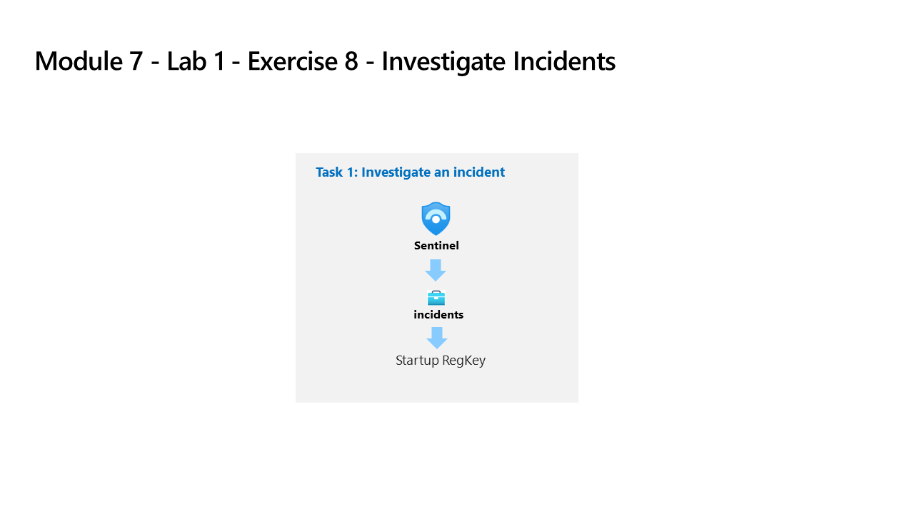

---
lab:
  title: Übung 8 – Untersuchen von Incidents
  module: Learning Path 7 - Create detections and perform investigations using Microsoft Sentinel
---

# Lernpfad 7– Lab 1 – Übung 8 – Untersuchen von Incidents

## Labszenario

Sie sind als Security Operations Analyst für ein Unternehmen tätig, das Microsoft Sentinel implementiert hat. Sie haben bereits geplante und Microsoft Security Analytics-Regeln erstellt. Die Fusions- und Anomalieanalyseregeln sind auch in Ihrer Umgebung aktiviert. Nun ist es an der Zeit, die Incidents zu untersuchen, die durch diese Regeln verursacht wurden.

Ein Vorfall kann mehrere Warnungen enthalten. Es ist eine Aggregation aller relevanten Beweise für eine bestimmte Untersuchung. Die Eigenschaften, die zu den Warnungen gehören, z. B. Schweregrad und Status, werden auf Vorfallsebene festgelegt. Nachdem Sie Microsoft Sentinel mitgeteilt haben, nach welchen Arten von Bedrohungen Sie suchen und wie Sie diese finden, können Sie die erkannten Bedrohungen durch die Untersuchung von Incidents überwachen.

>**Hinweis:** Eine **[interaktive Labsimulation](https://mslabs.cloudguides.com/guides/SC-200%20Lab%20Simulation%20-%20Investigate%20incidents)** ist verfügbar, mit der Sie dieses Lab in Ihrem eigenen Tempo durcharbeiten können. Möglicherweise liegen geringfügige Unterschiede zwischen der interaktiven Simulation und dem gehosteten Lab vor, aber die dargestellten Kernkonzepte und Ideen sind identisch. 

### Aufgabe 1: Untersuchen eines Incidents

In dieser Aufgabe untersuchen Sie einen Incident.

1. Melden Sie sich beim virtuellen Computer WIN1 als Administrator mit dem Kennwort **Pa55w.rd** an.  

1. Navigieren Sie im Edge-Browser zum Azure-Portal unter https://portal.azure.com.

1. Kopieren Sie im Dialogfeld **Anmelden** die **E-Mail vom Mandanten**, die Sie von Ihrem Labhostinganbieter erhalten haben, und wählen Sie **Weiter**.

1. Kopieren Sie im Dialogfeld **Kennwort eingeben** das **Kennwort des Mandanten**, das Sie von Ihrem Labhostinganbieter erhalten haben, und fügen Sie es ein. Wählen Sie dann **Anmelden**.

1. Geben Sie in der Suchleiste des Azure-Portals *Sentinel* ein, und wählen Sie dann ** Microsoft Sentinel** aus.

1. Wählen Sie Ihren zuvor erstellten Microsoft Sentinel-Arbeitsbereich aus.

1. Wählen Sie die Seite **Incidents** aus.

1. Überprüfen Sie die Liste der Incidents.

    >**Hinweis:** Die Analyseregeln generieren Warnungen und Incidents für denselben spezifischen Protokolleintrag. Denken Sie daran, dass dies in der Konfiguration *Abfrageplanung* gemacht wurde, um mehr Warnungen und Incidents zu erzeugen, die im Lab verwendet werden können.
  
1. Wählen Sie eines der **Startup-RegKey**-Incidents aus.

1. Sehen Sie sich die Details des Incidents auf dem rechten Blatt an, das sich geöffnet hat. Scrollen Sie nach unten und klicken Sie auf die Schaltfläche **Vollständige Details anzeigen**.

1. Wenn das Popup-Fenster „Neue Incident-Umgebung“ erscheint, folgen Sie den Anweisungen und lesen Sie die Informationen, indem Sie auf die Schaltfläche **Weiter** klicken.

1. Ändern Sie den Status auf der linken Seite des Incidents auf **Aktiv** und klicken Sie dann auf **Anwenden**.

1. Scrollen Sie nach unten zum Bereich *Tags*, wählen Sie **+** aus, geben Sie **RegKey** ein und klicken Sie auf **OK**.

1. Scrollen Sie nach unten und geben Sie im Feld *Kommentar schreiben …* folgendes ein: *Ich werde das recherchieren* und wählen Sie das Symbol **>** aus, um den neuen Kommentar abzuschicken.

1. Blenden Sie das linke Blatt aus, indem Sie das **<<** Symbol neben dem Besitzer auswählen.

1. Lesen Sie den Inhalt des Fensters **Zeitleiste des Incidents**. Klicken Sie bei der Warnung *Startup-RegKey* auf die Auslassungspunkte **(...)** und dann auf **Playbook ausführen**.  Sie sehen das Playbook *PostMessageTeams-OnAlert*. Mit dieser Option können Sie Playbooks manuell ausführen.

1. Schließen Sie das Blatt *Playbook-Warnungen* durch Klicken auf das Symbol **x** in der oberen rechten Ecke.

1. Lesen Sie den Inhalt des Fensters **Entitäten**. Es sollte mindestens die Entität *Host* erscheinen, die wir in der KQL-Abfrage der vorherigen Übung zugeordnet haben. **Hinweis:** Wenn keine Entitäten angezeigt werden, aktualisieren Sie die Seite.

1. Wählen Sie in der Befehlsleiste die neue Schaltfläche **Aufgaben (Vorschau)** aus.

1. Wählen Sie **+ Aufgabe hinzufügen**, geben Sie im Feld „Titel“ **Überprüfen, wem der Computer gehört** ein und klicken Sie auf **Speichern**.

1.  Schließen Sie die Registerkarte *Incidents-Aufgaben (Vorschau)*, indem Sie auf das Symbol **x** oben rechts klicken.

1. Klicken Sie in der Befehlsleiste auf die neue Schaltfläche **Aktivitätsprotokoll**.

1. Überprüfen Sie die Aktionen, die Sie während dieser Übung durchgeführt haben.

1. Schließen Sie die Registerkarte *Incidents-Aktivitätsprotokoll*, indem Sie auf das Symbol **x** oben rechts klicken.

1. Wählen Sie im fast unsichtbaren linken Karteireiter das Benutzersymbol mit der Bezeichnung **Nicht zugeordnet** aus. Die neue Incident-Erfahrung ermöglicht schnelle Änderungen von hier aus.

1. Wählen Sie **Mir zuweisen** aus, scrollen Sie dann nach unten und klicken Sie auf **Anwenden**, um die Änderungen zu speichern.

1. Erweitern Sie das linke Blatt, indem Sie das Symbol **>>** auswählen. und klicken Sie dann auf die Schaltfläche **Untersuchen**.

    >**Hinweis:** Wenn die Symbole zu klein für Ihren Bildschirm sind, klicken Sie auf **(+)**, um sie zu vergrößern.

1. **Bewegen Sie den Mauszeiger über** das WINServer-Symbol für die Entität und warten Sie, bis neue *Erkundungsabfragen* angezeigt werden. Es scheint, dass *Verwandte Warnungen* mehr Daten enthält. Wählen Sie den Namen der Erkundungsabfrage **Zusammenhängende Warnungen**, um sie in das Erkundungsdiagramm zu verschieben, oder wählen Sie **Ereignisse >** aus, um sie mit einer KQL-Abfrage zu untersuchen.

1. Schließen Sie das Abfragefenster, indem Sie das Symbol **X** oben rechts auswählen, um zur Seite *Untersuchung* zurückzukehren.

1. Wählen Sie nun die Entität **WINServer** aus. Auf der rechten Seite öffnet sich ein Fenster mit detaillierteren Informationen. Lesen Sie den Inhalt der **Infoseite**.

1. Wählen Sie die Schaltfläche **Zeitleiste** aus. Bewegen Sie den Mauszeiger über die Incidents, um zu sehen, welche Incidents zu welchem Zeitpunkt im Diagramm aufgetreten sind.

1. Klicken Sie auf die Schaltfläche **Entitäten** und sehen Sie sich die *Entitäten* und *Warnungen* an, die sich auf *WINServer* beziehen.

1. Schließen Sie das Untersuchungsdiagramm, indem Sie das Symbol **X** oben rechts auf der Seite auswählen.

1. Zurück auf der Incident-Seite wählen Sie im linken Bereich **Aktiver Status** und dann **Geschlossen** aus. 

1. In der Dropdownliste *Klassifizierung wählen* überprüfen Sie die verschiedenen Optionen. Wählen Sie dann **True Positive – verdächtige Aktivität** und klicken Sie anschließend auf **Anwenden**.

## Fahren Sie mit Übung 9 fort
