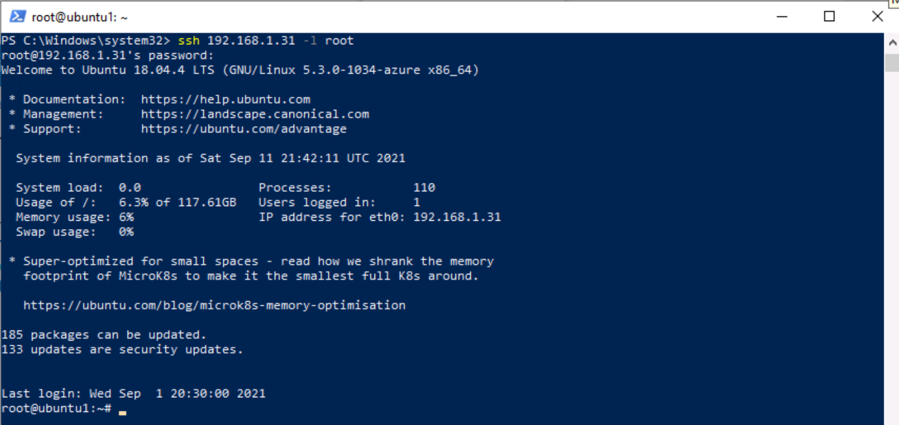

---
lab:
  title: Übung 3 – Verbinden von Linux-Hosts mit Microsoft Sentinel über Datenconnectors
  module: Learning Path 8 - Connect logs to Microsoft Sentinel
---

# Lernpfad 8 – Lab 1 – Übung 3: Verbinden des Linux-Hosts mit Microsoft Sentinel mithilfe von Datenconnectors

## Labszenario


Sie sind als Security Operations Analyst für ein Unternehmen tätig, das Microsoft Sentinel implementiert hat. Nun müssen Sie herausfinden, wie Protokolldaten aus den verschiedenen Datenquellen in Ihrer Organisation verbunden werden. Die nächste Datenquelle sind virtuelle Linux-Computer, die das Common Event Formatting (CEF) über den Connector des Agents einer Vorgängerversion und Syslog verwenden.

>**Wichtig:** Die Lab-Übungen für Lernpfad Nr. 8 befinden sich in einer *eigenständigen* Umgebung. Wenn Sie das Lab vor dem Abschluss verlassen, müssen Sie die Konfigurationen erneut ausführen.

### Geschätzte Zeit bis zum Abschluss dieses Labs: 30 Minuten

>**Wichtig:** Bei den nächsten Aufgaben gibt es Schritte, die auf verschiedenen virtuellen Computern ausgeführt werden. Suchen Sie nach den Namensverweisen der virtuellen Maschine.

### Aufgabe 1: Zugriff auf den Microsoft Sentinel-Arbeitsbereich

In dieser Aufgabe greifen Sie auf Ihren Microsoft Sentinel-Arbeitsbereich zu.

>**Hinweis:** Microsoft Sentinel wurde in Ihrem Azure-Abonnement mit dem Namen **defenderWorkspace** vorab bereitgestellt, und die erforderlichen *Content Hub*-Lösungen wurden installiert.

1. Melden Sie sich beim virtuellen Computer **WIN1** als Administrator mit dem Kennwort **Pa55w.rd**an.  

1. Starten Sie den Microsoft Edge-Browser.

1. Navigieren Sie im Edge-Browser zum Azure-Portal unter <https://portal.azure.com>.

1. Kopieren Sie im Dialogfeld **Anmelden** die **E-Mail vom Mandanten**, die Sie von Ihrem Labhostinganbieter erhalten haben, und wählen Sie **Weiter**.

1. Kopieren Sie im Dialogfeld **Kennwort eingeben** das **Kennwort des Mandanten**, das Sie von Ihrem Labhostinganbieter erhalten haben, und fügen Sie es ein. Wählen Sie dann **Anmelden**.

1. Geben Sie in der Suchleiste des Azure-Portals *Sentinel* ein, und wählen Sie dann ** Microsoft Sentinel** aus.

1. Wählen Sie den Microsoft Sentinel **defenderWorkspace** aus.

### Aufgabe 2: Verbinden eines Linux-Hosts mithilfe des Common Event Format-Connectors

In dieser Aufgabe verbinden Sie einen Linux-Host mit Microsoft Sentinel mit dem Common Event Format (CEF) über den Connector des Agents einer Vorgängerversion.

1. Scrollen Sie im Bereich Microsoft Sentinel im linken Menü nach unten zu *Inhaltsverwaltung*, und wählen Sie **Content Hub** aus.

1. Suchen Sie im *Content Hub* nach der Lösung **Common Event Format** und wählen Sie diese aus der Liste aus.

1. Wählen Sie auf der Lösungsseite *Common Event Format* **Verwalten** aus.

    >**Hinweis:** Die Lösung *Common Event Format* installiert sowohl den *Common Events Format (CEF) über AMA* als auch die Datenconnectors *Common Events Format (CEF)*.

1. Wählen Sie das *Common Events Format (CEF) über den AMA*-Datenconnector aus und wählen Sie auf dem Blatt „Connector-Informationen“ die Option **Connector-Seite öffnen** aus.

1. Kopieren Sie im Abschnitt *Konfiguration* unter der Registerkarte *Anweisungen* den in *1.2 Installieren des CEF-Collectors auf dem Linux-Computer* gezeigten Befehl in die Zwischenablage.

1. Starten Sie den virtuellen Computer **LIN1**. Melden Sie sich mit dem Benutzernamen und dem Kennwort an, die Sie von Ihrem Lab-Hoster erhalten haben. **Hinweis:** Möglicherweise müssen Sie die Eingabetaste drücken, um die Anmeldeaufforderung anzuzeigen.

1. Notieren Sie sich die IP-Adresse Ihres LIN1-Servers. Ein Beispiel dafür sehen Sie im unten stehenden Screenshot:

    

1. Kehren Sie zum virtuellen Computer **WIN1** zurück. Starten Sie Windows PowerShell, indem Sie **Windows PowerShell** in das Suchformular in der Taskleiste eingeben, und wählen Sie dann **Windows PowerShell** aus.

1. Geben Sie den folgenden PowerShell-Befehl ein, passen Sie ihn an Ihre spezifischen Linux-Serverinformationen an und drücken Sie die Eingabetaste:

    ```PowerShell
    ssh insert-your-linux-IP-address-here -l insert-linux-user-name-here
    ```

1. Geben Sie *Ja* ein, um die Verbindung zu bestätigen, geben Sie dann das Kennwort des Benutzers ein und drücken Sie die Eingabetaste. Ihr Bildschirm sollte nun wie folgt aussehen:

    

1. Jetzt können Sie den Befehl *1.2 Installieren des CEF-Collectors auf dem Linux-Computer* aus dem vorherigen Schritt einfügen. Stellen Sie sicher, dass sich das Azure-Skript in der Zwischenablage befindet. Klicken Sie in PowerShell mit der rechten Maustaste auf die obere Leiste und wählen Sie **Bearbeiten** und dann **Einfügen**. aus. 

1. Fügen Sie nach dem Einfügen und vor dem Drücken der Eingabetaste das Zeichen **3** an das Wort *python* hinzu, wie unten gezeigt:

    


1. Wenn Sie das Skript angepasst haben, drücken Sie die Eingabetaste. Das Skript wird remote auf Ihrem Linux-Server ausgeführt. Wenn das Skript ordnungsgemäß ausgeführt wird, sollte der Bildschirm so aussehen:

    

1. Geben Sie **exit** ein, um die Remoteshellverbindung zu LIN1 zu schließen.


### Aufgabe 3: Verbinden eines Linux-Hosts mit dem Syslog-Connector

In dieser Aufgabe verbinden Sie einen Linux-Host mit Microsoft Sentinel über den Syslog-Connector.

1. Kehren Sie zum Microsoft Edge-Browser zurück, in dem Sie das Microsoft Sentinel-Portal geöffnet haben, und schließen Sie die Seite „Datenconnector“ Common Event Format (CEF) über den Agent einer Vorgängerversion, indem Sie auf das „x“ in der oberen rechten Ecke klicken.

1. Scrollen Sie im Bereich Microsoft Sentinel im linken Menü nach unten zu *Inhaltsverwaltung*, und wählen Sie **Content Hub** aus.

1. Suchen Sie im *Content Hub* nach der Lösung **Syslog** und wählen Sie diese aus der Liste aus.

1. Wählen Sie auf der Lösungsseite *Syslog***Verwalten** aus.

    >**Hinweis:** Die Lösung *Syslog* installiert den Datenconnector *Syslog*, 7 Analyseregeln, 9 Hunting-Abfragen, 2 Parser und 21 Arbeitsmappen.

1. Wählen Sie den Datenconnector *Syslog über Legacy-Agent* aus und danach **Connectorseite öffnen** auf dem Informationsblatt des Connectors.

1. Erweitern Sie im Abschnitt *Konfiguration* die Option **Agent auf einer Nicht-Azure Linux-Computer installieren**.

1. Klicken Sie auf den Link **Agent für Linux-Computer (kein Azure) herunterladen und installieren**.

    >**Hinweis:** Ihr Arbeitsbereich für Protokollanalysen sollte *2 verbundene Windows-Computer anzeigen*. Dies entspricht den zuvor verbundenen virtuellen Computern WINServer und AZWIN01.

1. Wählen Sie die Registerkarte für **Linux-Server**aus.

    >**Hinweis:** Ihr Arbeitsbereich für Protokollanalysen sollte *1 verbundene Linux-Computer* anzeigen. Dies entspricht dem virtuellen computer LIN1 (ubuntu1), der zuvor mit dem CEF-Connector verbunden wurde.

1. Wählen Sie **Anweisungen für den Protokollanalyse-Agent** aus.

1. Kopieren Sie den Befehl *Agent für Linux herunterladen und Onboarding durchführen* in die Zwischenablage.

1. Starten Sie Ihren virtuellen Computer LIN2. Melden Sie sich mit dem Benutzernamen und dem Kennwort an, die Sie von Ihrem Lab-Hoster erhalten haben. **Hinweis:** Möglicherweise müssen Sie die Eingabetaste drücken, um die Anmeldeaufforderung anzuzeigen.

1. Notieren Sie sich die IP-Adresse Ihres LIN2-Servers. Ein Beispiel dafür sehen Sie im unten stehenden Screenshot:

    

1. Kehren Sie zum virtuellen Computer **WIN1** zurück. Wählen Sie die Windows PowerShell, die Sie in der vorherigen Aufgabe verwendet haben.

1. Geben Sie den folgenden PowerShell-Befehl ein, passen Sie ihn an Ihre spezifischen Linux-Serverinformationen an und drücken Sie die Eingabetaste:

    ```PowerShell
    ssh insert-your-linux-IP-address-here -l insert-linux-user-name-here
    ```

1. Geben Sie *Ja* ein, um die Verbindung zu bestätigen, geben Sie dann das Kennwort des Benutzers ein und drücken Sie die Eingabetaste. Ihr Bildschirm sollte nun wie folgt aussehen:

    

1. Fügen Sie nun den Befehl *Agent für Linux herunterladen und Onboarding durchführen* aus dem vorherigen Schritt ein. Stellen Sie sicher, dass sich das Skript in der Zwischenablage befindet. Klicken Sie in PowerShell mit der rechten Maustaste auf die obere Leiste und wählen Sie **Bearbeiten** und dann **Einfügen**. aus.

1. Wenn das Skript eingefügt ist, drücken Sie die Eingabetaste. Das Skript wird remote auf Ihrem Linux-Server ausgeführt. Warten

1. Wenn es fertig ist, geben Sie **exit** ein, um die Remoteshellverbindung zu LIN2 zu schließen.

### Aufgabe 4: Konfigurieren der zu erfassenden Einrichtungen und die zugehörigen Schweregrade für den Syslog-Connector

In dieser Aufgabe konfigurieren Sie die Syslog-Sammelstellen.

1. Kehren Sie zu dem Edge-Browser zurück, in dem Sie das Microsoft Sentinel-Portal geöffnet haben, und schließen Sie die Seite „Arbeitsbereich für Protokollanalysen“ und die Seite „Syslog“- Datenconnector, indem Sie zweimal  auf das ‚x‘ in der oberen rechten Ecke klicken.

1. Wählen Sie im Microsoft Sentinel-Portal unter *Konfiguration* die Option **Einstellungen** aus und dann die Registerkarte **Arbeitsbereich-Einstellungen**.

1. Wählen Sie **Verwaltung von Agents einer Vorgängerversion** im Bereich *Classic* aus.

1. Wählen Sie die Registerkarte **Syslog** aus.

1. Klicken Sie auf die Schaltfläche **+ Einrichtung hinzufügen**.

1. Wählen Sie **Authentifizierung** aus dem Dropdownmenü für *Name der Einrichtung* aus.

1. Wählen Sie erneut die Schaltfläche **+ Einrichtung hinzufügen** aus.

1. Wählen Sie **syslog** aus dem Dropdownmenü für *Name der Einrichtung* aus.

1. Wählen Sie **Übernehmen** aus, um die Änderungen zu speichern.

## Fahren Sie mit Übung 4 fort
