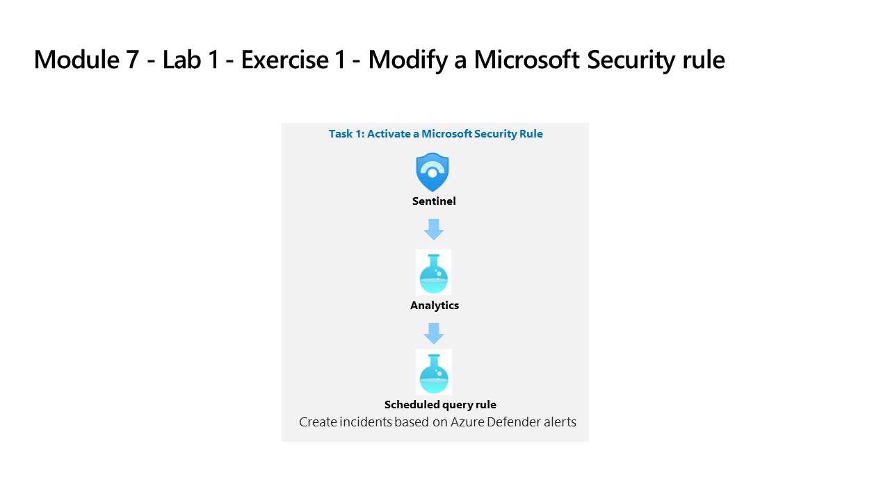

---
lab:
  title: Übung 1 – Ändern einer Microsoft-Sicherheitsregel
  module: Learning Path 9 - Create detections and perform investigations using Microsoft Sentinel
---

# Lernpfad 9 – Lab 1 – Übung 1: Ändern einer Microsoft-Sicherheitsregel

## Labszenario

Sie sind als Security Operations Analyst für ein Unternehmen tätig, das Microsoft Sentinel implementiert hat. Sie müssen lernen, Bedrohungen mithilfe von Microsoft Sentinel zu erkennen und abzuwehren. Zunächst müssen Sie die von Defender for Cloud in Microsoft Sentinel eingehenden Warnmeldungen nach Schweregrad filtern.

>**Wichtig:** Die Lab-Übungen für Lernpfad Nr. 9 befinden sich in einer *eigenständigen* Umgebung. Wenn Sie das Lab vor dem Abschluss verlassen, müssen Sie die Konfigurationen erneut ausführen.

### Geschätzte Zeit bis zum Abschluss dieses Labs: 10 Minuten

### Aufgabe 1: Aktivieren einer Microsoft-Sicherheitsregel

In dieser Aufgabe aktivieren Sie eine Microsoft-Sicherheitsregel.

>**Hinweis:** Microsoft Sentinel wurde in Ihrem Azure-Abonnement mit dem Namen **defenderWorkspace** vorab bereitgestellt, und die erforderlichen *Content Hub-Lösungen* wurden installiert.

1. Melden Sie sich beim virtuellen Computer WIN1 als Administrator mit dem Kennwort **Pa55w.rd** an.  

1. Navigieren Sie im Microsoft Edge-Browser zu der Azure-Portal unter <https://portal.azure.com>.

1. Kopieren Sie im Dialogfeld **Anmelden** die **E-Mail vom Mandanten**, die Sie von Ihrem Labhostinganbieter erhalten haben, und wählen Sie **Weiter**.

1. Kopieren Sie im Dialogfeld **Kennwort eingeben** das **Kennwort des Mandanten**, das Sie von Ihrem Labhostinganbieter erhalten haben, und fügen Sie es ein. Wählen Sie dann **Anmelden**.

1. Geben Sie in der Suchleiste des Azure-Portals *Sentinel* ein, und wählen Sie dann ** Microsoft Sentinel** aus.

1. Wählen Sie den Microsoft Sentinel **defenderWorkspace** aus.

1. Wählen Sie im Bereich Konfiguration **Analytics** aus.

1. Klicken Sie in der Befehlsleiste auf die Schaltfläche **+ Erstellen** und wählen Sie **Microsoft Incident-Regelerstellung** aus.

1. Geben Sie unter *„Name“* „**Vorfälle basierend auf Defender for Cloud erstellen**“ ein.

1. Scrollen Sie nach unten und wählen Sie unter *Microsoft Security Service* **Microsoft Defender for Cloud** aus.

1. Wählen Sie unter *Nach Schweregrad filtern* die Option *Benutzerdefiniert* aus und wählen Sie **Niedrig**, **Mittel** und **Hoch** für den Schweregrad aus. Danach kehren Sie zur Regel zurück.

1. Wählen Sie die Schaltfläche **Weiter: Automatische Antwort** und dann die Schaltfläche **Weiter: Prüfen und erstellen** aus.

1. Überprüfen Sie die vorgenommenen Änderungen und wählen Sie die Schaltfläche **Speichern** aus. Die Analytics-Regel wird gespeichert und Vorfälle werden erstellt, wenn in Defender for Cloud eine Warnung angezeigt wird.

1. Sie haben jetzt einen *Fusion* und einen *Microsoft Security* Warnungstypen.

## Fahren Sie mit Übung 2 fort
