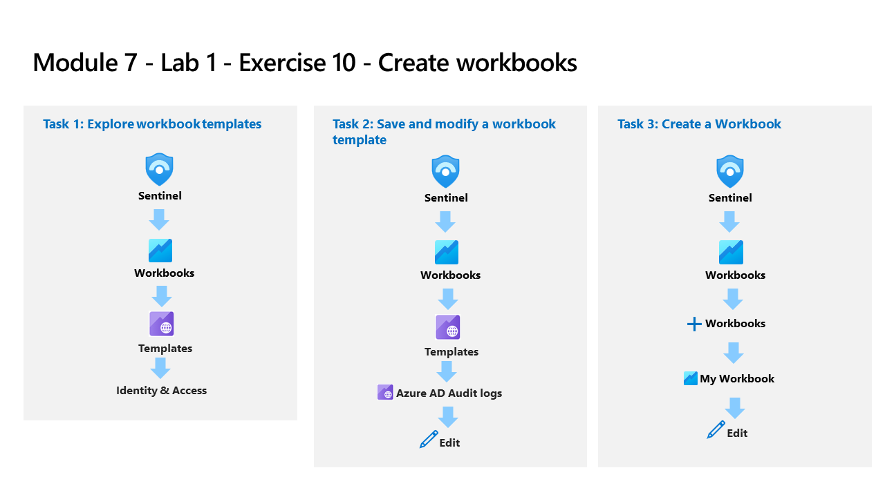

---
lab:
  title: Übung 10 – Erstellen von Arbeitsmappen
  module: Learning Path 9 - Create detections and perform investigations using Microsoft Sentinel
---

# Lernpfad 9 – Lab 1 – Übung 10: Erstellen von Arbeitsmappen

## Labszenario

Sie sind als Security Operations Analyst für ein Unternehmen tätig, das Microsoft Sentinel implementiert hat. Sobald Sie Ihre Datenquellen mit Microsoft Sentinel verbunden haben, können Sie die Daten mit der Microsoft Sentinel-Adaption von Azure Monitor Workbooks visualisieren und überwachen, was die Erstellung benutzerdefinierter Dashboards ermöglicht. 

Microsoft Sentinel ermöglicht es Ihnen, benutzerdefinierte Arbeitsmappen für Ihre Daten zu erstellen, und enthält außerdem integrierte Arbeitsmappenvorlagen, mit denen Sie schnell Einblicke in Ihre Daten gewinnen können, sobald Sie eine Datenquelle anschließen.

>**Wichtig:** Die Lab-Übungen für Lernpfad Nr. 9 befinden sich in einer *eigenständigen* Umgebung. Wenn Sie das Lab vor dem Abschluss verlassen, müssen Sie die Konfigurationen erneut ausführen.

### Geschätzte Zeit bis zum Abschluss dieses Labs: 30 Minuten

### Aufgabe 1: Erkunden von Arbeitsmappenvorlagen

In dieser Aufgabe erkunden Sie die Microsoft Sentinel-Arbeitsmappenvorlagen.

>**Hinweis:** Microsoft Sentinel wurde in Ihrem Azure-Abonnement mit dem Namen **defenderWorkspace** vorab bereitgestellt, und die erforderlichen *Content Hub-Lösungen* wurden installiert.

1. Melden Sie sich beim virtuellen Computer WIN1 als Administrator mit dem Kennwort **Pa55w.rd** an.  

1. Navigieren Sie im Edge-Browser zum Azure-Portal unter <https://portal.azure.com>.

1. Kopieren Sie im Dialogfeld **Anmelden** die **E-Mail vom Mandanten**, die Sie von Ihrem Labhostinganbieter erhalten haben, und wählen Sie **Weiter**.

1. Kopieren Sie im Dialogfeld **Kennwort eingeben** das **Kennwort des Mandanten**, das Sie von Ihrem Labhostinganbieter erhalten haben, und fügen Sie es ein. Wählen Sie dann **Anmelden**.

1. Geben Sie in der Suchleiste des Azure-Portals *Sentinel* ein, und wählen Sie dann ** Microsoft Sentinel** aus.

1. Wählen Sie den Microsoft Sentinel **defenderWorkspace** aus.

1. Wählen Sie im Navigationsmenü unter *Berohungsmanagement* die Option **Workbooks** aus.

1. Wählen Sie die Registerkarte *Vorlagen* aus und suchen Sie die Arbeitsmappe **Azure Activity**.

1. Scrollen Sie im rechten Bereich „Details“ nach unten und klicken Sie auf die Schaltfläche **Vorlage anzeigen**.

1. Überprüfen Sie den Inhalt der Arbeitsmappe. Sie zeigt einen Überblick über Ihre Azure-Abonnementvorgänge, indem Daten aus dem Aktivitätsprotokoll gesammelt und analysiert werden.

1. Schließen Sie die Arbeitsmappe, indem Sie in der oberen rechten Ecke das **X** auswählen.

### Aufgabe 2: Speichern und Ändern einer Arbeitsmappenvorlage

In dieser Aufgabe speichern und ändern Sie eine Arbeitsmappenvorlage.

1. Sie sollten sich wieder auf der Registerkarte **Microsoft Sentinel | Arbeitsmappen | Vorlagen** befinden, wobei die Arbeitsmappe *Azure Activity* noch ausgewählt ist.

1. Scrollen Sie erneut nach unten und wählen Sie die Schaltfläche **Speichern** im Bereich „Arbeitsmappen-Details“ der *Azure-Aktivität* aus.

1. Belassen Sie **East US** als Standardwert für *Region* und wählen Sie **OK** aus.

1. Wählen Sie die Schaltfläche **Gespeicherte Arbeitsmappe anzeigen** aus.

1. Wählen Sie in der Befehlsleiste **Bearbeiten** aus, um Änderungen an der Arbeitsmappe vorzunehmen.

1. Scrollen Sie nach unten zum Bereich *Anruferaktivitäten* und achten Sie auf die Farbe der Spalte *Aktivitäten*, da wir diese Spalten formatieren werden. Wählen Sie die Schaltfläche **Bearbeiten** unter dem Raster aus.

1. Wählen Sie die Schaltfläche **Spalteneinstellungen**aus. Sie befindet sich rechts neben der Befehlsleiste *Abfrage ausführen*. **Hinweis:** Diese Schaltfläche wird nur angezeigt, wenn Daten aus der KQL-Abfrage vorhanden sind.

1. Wählen Sie in dem nun erscheinenden Fenster *Spalteneinstellungen bearbeiten* unter *Spalten* die Option **Aktivitäten**aus.

1. Ändern Sie den Wert für *Säulenrenderer* auf **Wärmebild**. Scrollen Sie für *Farbpalette* nach unten und wählen Sie **32-Farben kategorisch**aus.

1. Wählen Sie **Anwenden** und dann **Speichern und schließen**. Beachten Sie die Änderung in der Spalte *Aktivitäten*.

1. Wählen Sie **Bearbeitung abgeschlossen** am unteren Rand der Abfrage (nicht im oberen Menü) aus.

1. Wählen Sie nun im oberen Menü **Bearbeitung beendet** und wählen Sie das Symbol **Speichern** aus. 

1. Schließen Sie die Arbeitsmappe, indem Sie in der oberen rechten Ecke das **X** auswählen.

### Aufgabe 3: Erstellen einer Arbeitsmappe

In dieser Aufgabe erstellen Sie eine neue Arbeitsmappe mit erweiterten Visualisierungen.

1. Sie sollten sich wieder im Bereich **Arbeitsmappen** des Microsoft Sentinel-Portals befinden.

1. Wählen Sie **+ Arbeitsmappe hinzufügen**, um eine neue Arbeitsmappe von Grund auf zu erstellen. 

    >**Hinweis:** Obwohl es sich um eine neue Arbeitsmappe handelt, wird eine Startvorlage verwendet.

1. Um die Arbeitsmappe zu bearbeiten, wählen Sie **Bearbeiten** aus.

1. Wählen Sie unter dem ersten Absatz der Arbeitsmappe die Schaltfläche **Bearbeiten** aus.

1. Geben Sie *# Meine Arbeitsmappe* in eine neue Zeile oberhalb von *## Neue Arbeitsmappe* ein.

1. Wählen Sie unten in diesem Abschnitt **Bearbeitung abgeschlossen**, *Bearbeitung des Textelements: Text – 2* aus Beachten Sie, dass ihre Kopfzeile die Größe erhöht und der Name geändert wurde.

1. Wählen Sie unter dem einzigen sichtbaren Balkendiagramm **Bearbeiten** aus.

1. Überprüfen Sie die KQL-Anweisung, die eine *Union*-Anweisung über alle Zählungen in allen Tabellen liefert.

1. Scrollen Sie nach unten und wählen Sie im unteren Menü **Bearbeitung abgeschlossen** für die *Bearbeitung der Abfrage: Abfrage – 2*aus.

1. Wählen Sie das Auslassungszeichen **…** neben der Schaltfläche *Bearbeiten* des Balkendiagramms, wählen Sie **+ Hinzufügen** und dann **Abfrage hinzufügen** aus.

1. Geben Sie **SecurityEvent** in das Abfragefeld ein.

1. Ändern Sie den *Zeitbereich* in **Letzte Stunde**.

1. Ändern Sie die *Visualisierung* in **Zeitdiagramm**.

1. Wählen Sie die Registerkarte **Stil** in der Befehlsleiste der Abfrage aus.

1. Aktivieren Sie das Kontrollkästchen **Benutzerdefinierte Breite für dieses Element festlegen**.

1. Setzen Sie die *Prozentuale Breite* auf **25** und *Maximale Breite* auf **25**.

1. Wählen Sie nun die Registerkarte **Erweiterte Einstellungen** in der Befehlsleiste der Abfrage aus.

1. Aktivieren Sie das Kontrollkästchen **Aktualisierungssymbol anzeigen, wenn keine Bearbeitung stattfindet**.

1. Scrollen Sie nach unten und wählen Sie im unteren Menü **Bearbeitung abgeschlossen ** für die neue *Bearbeitung der Abfrage: Abfrage – 2* aus.

1. Scrollen Sie nach unten und wählen Sie unten in der Arbeitsmappe **+ Hinzufügen**, dann **Abfrage hinzufügen** aus.

1. Geben Sie **SecurityEvent** in das Abfragefeld ein.

1. Ändern Sie den *Zeitbereich* in **Letzte Stunde**.

1. Ändern Sie die *Visualisierung* in **Grid**.

1. Wählen Sie **Stil** in der Befehlsleiste der Abfrage.

1. Wählen Sie das Feld **Dieses Element mit einer benutzerdefinierten Breite versehen** aus.

1. Setzen Sie die *Prozentuale Breite* auf **75** und *Maximale Breite* auf **75**.

1. Scrollen Sie nach unten und wählen Sie im unteren Menü **Bearbeitung abgeschlossen ** für die neue *Bearbeitung der Abfrage: Abfrage – 3* aus.

1. Wählen Sie in der oberen Befehlsleiste der Arbeitsmappe **Bearbeitung abgeschlossen** aus.

1. Wählen Sie das Symbol **Speichern**aus und ändern Sie den *Titel* in **Meine Arbeitsmappe**.

1. Wählen Sie bei Bedarf die Ressourcengruppe **RG-Defender** und belassen Sie die anderen Werte als Standard.

1. Wählen Sie **Anwenden**, um einen Commit für die Änderungen auszuführen. 

1. Schließen Sie die Arbeitsmappe, indem Sie das **X** oben rechts auswählen oder wählen Sie **Arbeitsmappen** im Microsoft Sentinel-Portal aus.

1. Zurück auf der Seite *Arbeitsmappen*, wählen Sie die Registerkarte **Meine Arbeitsmappen** aus.

1. Wählen Sie die Arbeitsmappe, die Sie gerade erstellt haben, **Meine Arbeitsmappe** aus.

1. Wählen Sie im rechten Bereich **Gespeicherte Arbeitsmappe anzeigen**, um Ihre Arbeitsmappe zu überprüfen.

## Fahren Sie mit Übung 11 fort
